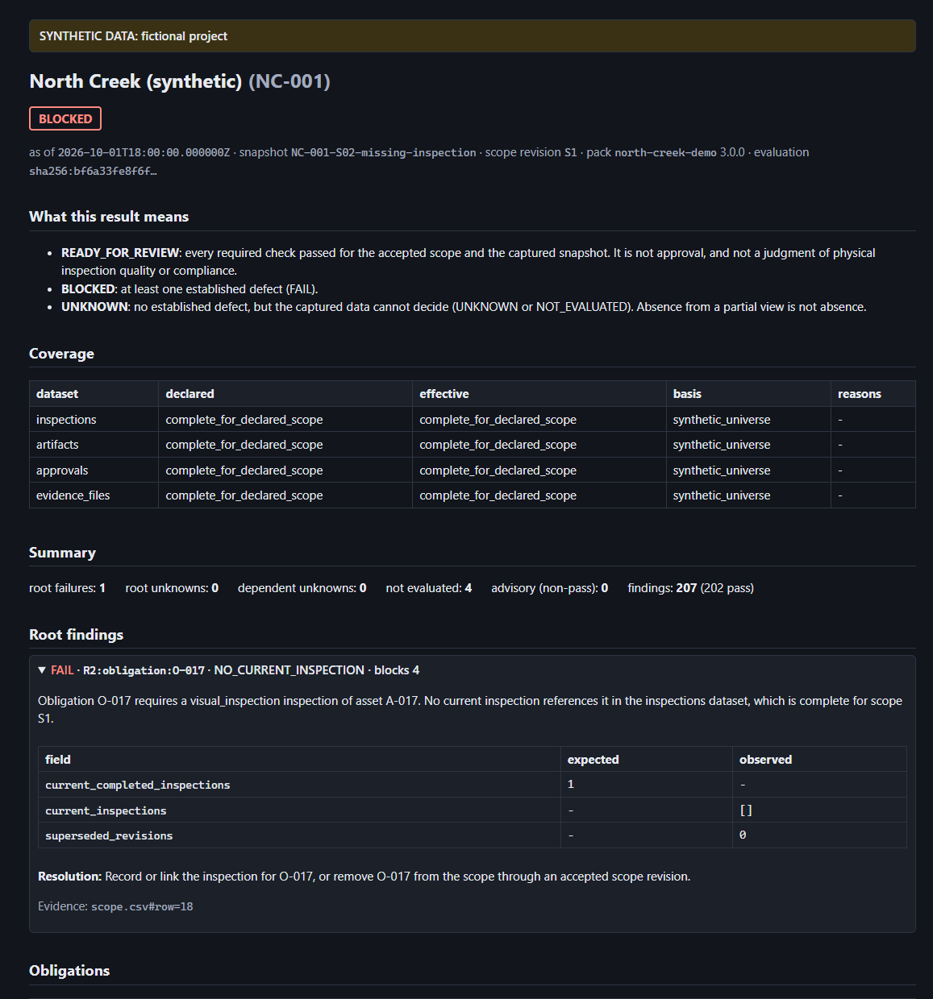

# inspection-reconcile

> Compare the work a project requires with the inspection records, documents and approvals actually captured.
> Explain every gap with its source evidence, and never report "ready" on evidence the tool could not see.

`inspection-reconcile` is a small, deterministic Python command-line tool. It decides whether a project's
inspection documentation package is **ready for review** under an explicit, versioned requirement pack.

- **Input:** a captured snapshot, as canonical CSV and JSON files or a Quickbase-shaped export read through an explicit field mapping.
- **Output:** a JSON assessment, a self-contained HTML report and a run manifest.

Three facts drive the design:

1. **Valid rows are not complete work.** Thirty-nine valid inspection records cannot satisfy forty obligations.
   Expected work comes from an independently accepted scope, never from the records being checked.
2. **Absence from a partial view is not absence.** A missing record proves nothing unless the capture is known to be
   complete. The tool keeps "established failure" separate from "could not determine".
3. **Approvals go stale.** An approval covers a specific inspection revision and specific evidence bytes. A later
   change to either is detected.



## Quick start

Requires Python 3.12+ and [uv](https://docs.astral.sh/uv/).

```bash
uv sync --all-extras
uv run inspection-reconcile demo --all --out out/demo
```

`demo --all` assesses every fixture scenario, checks each result against the hand-written oracle in
`fixtures/oracle.yaml`, and writes `out/demo/index.html` with a report per scenario.

## The demonstration in four steps

```bash
# 1. A project where one inspection was never recorded
uv run inspection-reconcile assess --snapshot fixtures/scenarios/S02-missing-inspection/snapshot \
    --policy policies/north-creek-demo.yml --out out/s02          # exit 10: BLOCKED

# 2. Open out/s02/report.html: R2 for O-017 is the single root failure; R3-R6 are "not evaluated"

# 3. The corrected capture
uv run inspection-reconcile assess --snapshot fixtures/scenarios/S06-corrected/snapshot \
    --policy policies/north-creek-demo.yml --out out/s06          # exit 0: READY_FOR_REVIEW

# 4. What changed
uv run inspection-reconcile compare --before out/s02 --after out/s06   # exactly R2-R6 for O-017
```

## Outcomes and statuses

Every finding is one of four outcomes:

| outcome | meaning |
|---|---|
| `PASS` | the requirement holds in every completion of the captured data |
| `FAIL` | the requirement fails in every completion: an established defect |
| `UNKNOWN` | the captured data cannot decide; the finding says what would resolve it |
| `NOT_EVALUATED` | a prerequisite did not pass; `blocked_by` names it |

Required findings roll up into the project status:

| status | when |
|---|---|
| `BLOCKED` | any FAIL |
| `UNKNOWN` | otherwise, any UNKNOWN or NOT_EVALUATED |
| `READY_FOR_REVIEW` | everything required passed |

`READY_FOR_REVIEW` is a statement about documentation for the captured snapshot. It is never approval, and never a
judgment of physical inspection quality or compliance.

| exit code | meaning |
|---|---|
| 0 | READY_FOR_REVIEW |
| 10 | BLOCKED |
| 11 | UNKNOWN |
| 2 | run error (bad configuration or input) |
| 20 | `compare` found differences |
| 30 | `demo`: a scenario did not match its oracle |

## The checks

| check | question |
|---|---|
| R0 input integrity | Are there duplicate keys, conflicting current revisions, invalid values, unsafe paths or dangling references? Defective rows are quarantined, never guessed. |
| R1 scope and coverage | Is there an accepted scope? How complete is each captured dataset, and on what basis? |
| R2 inspection cardinality | Does each obligation have exactly one current, completed inspection? |
| R3 identity consistency | Do the inspection and its documents name the obligation's project, asset and activity? |
| R4 required artifacts | Is there a current document of every kind the pack requires? |
| R5 artifact availability | Can every required file be read and hashed? Exact-case resolution behaves the same on every operating system. |
| R6 approval binding | Does the latest approval cover the current inspection revision and the current evidence bytes (digest binding), or at least the current revisions (revision binding)? |
| R7 unmatched records | Are there current inspections outside the accepted scope? Advisory only. |

The full semantics, including the open-world rule that decides PASS, FAIL and UNKNOWN, are in
[docs/SPEC.md](docs/SPEC.md).

## Other commands

```bash
uv run inspection-reconcile validate --snapshot DIR --policy FILE        # configuration check, list record defects
uv run inspection-reconcile evidence-digest --snapshot DIR --policy FILE --inspection INS-001
                                                                           # the digest an approval should store
uv run inspection-reconcile export-sqlite --snapshot DIR --policy FILE --out snapshot.sqlite
uv run inspection-reconcile normalize --export DIR --mapping mappings/quickbase-demo.yml --out DIR
uv run inspection-reconcile assess --export DIR --mapping mappings/quickbase-demo.yml --policy FILE --out DIR
```

### SQL cross-check

`export-sqlite` writes the snapshot's valid rows to SQLite. The queries in [`sql/`](sql/) independently re-derive
inspection cardinality, identity mismatches, missing document kinds, unmatched inspections and duplicate keys. The
test suite checks that they agree with the engine. For example:

```sql
-- current inspections that point outside the accepted scope (R7)
SELECT DISTINCT inspection_id
FROM inspections
WHERE is_current = 1
  AND (obligation_id IS NULL OR obligation_id NOT IN (SELECT obligation_id FROM obligations));
```

## Quickbase

The Quickbase adapter is built from Quickbase's published RESTful JSON API contract: the official OpenAPI
document and the API portal's field-type pages, checked on 2026-10-09 (SPEC §12.1). It has three parts:

- a field-ID **mapping**, verified against the live field list (`fieldType` and `mode`, not display labels);
- **normalize**, which turns a Quickbase-shaped export into a canonical snapshot (S16 normalizes to exactly the
  same identities as the canonical S01);
- a **read-only capture client**. It has:
  - an allowlist of four read operations, so no write or delete can be issued;
  - rate limiting and retries;
  - keyset pagination by Record ID#, falling back to skip paging if a realm refuses the keyset filter;
  - per-page total accounting and an interleaved two-pass consistency check;
  - streamed file downloads with a size cap;
  - token redaction.

```bash
# a Quickbase-shaped export, assessed through the field mapping (same identities as the canonical S01)
uv run inspection-reconcile assess --export fixtures/scenarios/S16-quickbase-clean/export \
    --mapping mappings/quickbase-demo.yml --policy policies/north-creek-demo.yml --out out/s16

# a read-only capture from your own Quickbase app; the token is read only from the environment
uv run inspection-reconcile capture-quickbase --config local/qb-capture.yml \
    --mapping mappings/quickbase-demo.yml --out out/capture
```

Copy [docs/qb-capture.example.yml](docs/qb-capture.example.yml) to start a capture configuration.

**Status:** tested against a mock Quickbase app that follows the published OpenAPI contract. A capture of that mock
app gives the same finding for every requirement as the canonical scenario. The capture has **not yet run against
a live Quickbase app**. [docs/c3-runbook.md](docs/c3-runbook.md) walks through that step with a test app built
from Appendix D of the spec.

## How it is tested

- **A hand-written oracle.** `fixtures/oracle.yaml` gives the expected status and every non-passing finding for 24
  scenarios. It was derived from the specification, not from the code, and re-derived independently in review.
  The tests never compute expected verdicts with the code under test.
- **An independent fixture generator.** `tools/make_fixtures.py` builds every scenario byte-for-byte reproducibly.
  It has its own digest implementation and never imports the package.
- **Fault injection.** Five deliberate defects (FI-1 … FI-5) must each make their target scenarios fail.
- **Properties.** Shuffling input rows never changes the result (P1). Two runs give byte-identical outputs (P2).
  Downgrading any dataset's coverage never turns a non-pass into a pass (P3).
- **Cross-platform.** CI compares the evaluation identities and report digests from Linux, Windows and macOS.
- **Independent reviews.** Separate review passes re-derived the oracle and checked the engine against the
  specification text alone. Every confirmed finding became a logged amendment, and every code defect got a
  regression test ([docs/decisions.md](docs/decisions.md)). [docs/status.md](docs/status.md) maps every invariant and acceptance
  criterion to the test that proves it.

## Repository map

| path | contents |
|---|---|
| `src/inspection_reconcile/` | engine (`engine/`), loading and the evidence probe (`io/`), outputs (`report/`), Quickbase (`adapters/`), CLI |
| `fixtures/` | the oracle and the 24 scenario snapshots and exports |
| `policies/`, `mappings/` | the demonstration requirement packs and the Quickbase field mapping |
| `sql/` | the SQL cross-check queries |
| `docs/SPEC.md` | the normative specification |
| `docs/decisions.md` | decisions and amendments |
| `docs/limitations.md` | what is verified, synthetic or unsupported |

## Limitations

- One problem at a time per obligation: a second, independent problem appears after the first is fixed.
- Revision binding cannot detect byte changes under an unchanged revision label (scenario S18 shows this).
- Coverage is a claim with a basis; the tool reports it but cannot prove that no hidden records exist.
- A hash proves bytes only: not authorship, truthfulness, or that the physical work was done.

See [docs/limitations.md](docs/limitations.md).

## Notice

All data in this repository is synthetic: the fictional North Creek project. Quickbase is a trademark of
Quickbase, Inc.; this project is not affiliated with or endorsed by Quickbase.

## License

MIT. See [LICENSE](LICENSE).
