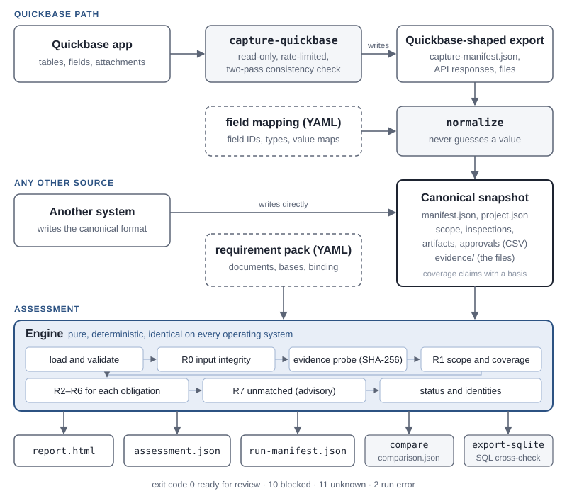

<!--
title: Administrator Guide
subtitle: Inspection documentation readiness, with a read-only Quickbase adapter
audience: Administrators and data integration developers who install, configure and integrate the tool
running: Administrator Guide
-->
# inspection-reconcile Administrator Guide

## About this guide

### Audience and scope

This guide is for the person who installs `inspection-reconcile`, prepares its inputs and connects it to a source
system: a Quickbase administrator, a data integration developer, or whoever runs it on a schedule. It covers the
architecture, installation, the requirement pack, the snapshot format, the Quickbase adapter, the security model, the
outputs and day-to-day operation.

Reading reports and acting on findings is covered by the [User Guide](user-guide.md).

### Where the details live

| document | role |
|---|---|
| [docs/SPEC.md](../SPEC.md) | the normative specification. Where this guide and the specification differ, the specification wins |
| [docs/decisions.md](../decisions.md) | every design decision and amendment, appended and never rewritten |
| [docs/limitations.md](../limitations.md) | what is verified, what is synthetic and what is unsupported |
| [docs/c3-runbook.md](../c3-runbook.md) | the step-by-step live verification against a Quickbase test app |
| [docs/status.md](../status.md) | the build steps, and which test proves each invariant and acceptance criterion |
| [SECURITY.md](../../SECURITY.md) | how to report a vulnerability privately |
| [CHANGELOG.md](../../CHANGELOG.md) | what changed in each release |

> [!NOTE]
> All data in the repository is synthetic: the fictional North Creek project (NC-001). Quickbase is a trademark of
> Quickbase, Inc.; this project is not affiliated with or endorsed by Quickbase.

## Architecture

### The pipeline



Two paths lead to the same place, a **canonical snapshot**:

- **From Quickbase**, `capture-quickbase` reads an app through a read-only client and writes a
  *Quickbase-shaped export*: the raw API responses, the attachments, and a capture manifest. `normalize` then turns the
  export into a canonical snapshot, using a **field mapping** that says which Quickbase field holds which value.
- **From any other system**, an integration writes the canonical snapshot directly: a manifest, a project file, four
  CSV files and an evidence folder.

The **engine** reads a snapshot and a **requirement pack** and produces the assessment. It is pure: no clock, no
network and no randomness. Evidence files are read only through a probe that hashes them. The same inputs therefore
give byte-identical `assessment.json` and `report.html` on every operating system.

### Repository layout

| path | contents |
|---|---|
| `src/inspection_reconcile/engine/` | the checks R0 to R7, coverage, status and identities |
| `src/inspection_reconcile/io/` | snapshot loading, the evidence probe, atomic output writes |
| `src/inspection_reconcile/report/` | `assessment.json`, `run-manifest.json`, `report.html`, `compare`, the reason-code templates |
| `src/inspection_reconcile/adapters/` | the Quickbase field mapping, `normalize`, the read-only HTTP client, the capture |
| `src/inspection_reconcile/cli.py` | the command line: arguments, exit codes, the top-level guard |
| `policies/`, `mappings/` | the demonstration requirement packs and the Quickbase field mapping |
| `fixtures/` | the oracle (`oracle.yaml`) and the 24 scenario snapshots and exports |
| `sql/` | the SQL cross-check queries |
| `tools/` | the fixture generator, the screenshot tool, the guide builder and the Appendix D test-app builder |
| `tests/` | unit, scenario, property, fault-injection, CLI, HTML, SQL, adapter and connector tests |

### Design principles

- **Never guess.** A defective record is quarantined and reported; an unmapped value is listed, never interpreted.
- **Closed-world inputs.** Every configuration file is validated member by member. An unknown member, a wrong type or
  an invalid value stops the run with exit code 2 and a message that names the file and the member.
- **Absence needs completeness.** A missing record is a failure only in a dataset whose capture is known to be
  complete, on a basis the requirement pack accepts.
- **Read-only.** Nothing in the package can write to a source system.
- **Synthetic public data.** Real captures belong in the gitignored `local/` folder.

## Installation

### Requirements

| component | version | needed for |
|---|---|---|
| Python | 3.12 or 3.13 | everything; CI tests both |
| [uv](https://docs.astral.sh/uv/) | current | creating the environment and running commands |
| Git | any | getting the repository |
| Chrome, Chromium or Edge | current | only to rebuild the screenshots and these guides |

Windows, macOS and Linux are all supported. CI runs the full suite on all three, with both Python versions, and
checks that every platform produces identical identities and report digests.

### Windows

In PowerShell:

```powershell
winget install --id=astral-sh.uv -e
git clone https://github.com/bochen2029-pixel/inspection-reconcile.git
cd inspection-reconcile
uv sync
```

### macOS and Linux

```bash
curl -LsSf https://astral.sh/uv/install.sh | sh        # or: brew install uv
git clone https://github.com/bochen2029-pixel/inspection-reconcile.git
cd inspection-reconcile
uv sync
```

uv's own installation guide lists other options, for example `pipx install uv`.

### Optional components

| command | installs | needed for |
|---|---|---|
| `uv sync` | PyYAML and Jinja2 | every command except `capture-quickbase` |
| `uv sync --extra quickbase` | the above, plus httpx | `capture-quickbase` |
| `uv sync --all-extras` | the above, plus pytest, hypothesis, ruff and mypy | development and the test suite |

### Verify the installation

```bash
uv run inspection-reconcile --version                         # inspection-reconcile 0.1.0
uv run inspection-reconcile demo --all --out out/demo         # exit 0: all 24 scenarios match their oracle
```

On the reference workstation, `demo --all` finishes in about 5 seconds, and a single assessment such as S02, with
its 207 findings, in under half a second. The same reports are published at
[bochen2029-pixel.github.io/inspection-reconcile](https://bochen2029-pixel.github.io/inspection-reconcile/), and the
project page is [opnaorta.ai/inspection-reconcile](https://opnaorta.ai/inspection-reconcile).

With the development extras installed, the full gate is the same one CI runs:

```bash
uv run pytest -q
uv run ruff check . && uv run ruff format --check .
uv run mypy
```

## The requirement pack

### Format

A requirement pack is a YAML file that states what a project's documentation must contain. The demonstration pack,
`policies/north-creek-demo.yml`:

```yaml
schema: inspection-reconcile/policy/v1
pack_id: north-creek-demo
version: "3.0.0"
effective_from: "2026-09-01"
synthetic: true
project_id: NC-001
scope_revision: S1
coverage:
  accepted_bases:
    - [synthetic_universe]
    - [query_total_matched, two_pass_stable, operator_attestation]
requirements:
  visual_inspection:
    document_kinds: [inspection_report, photo]
approval:
  required_binding: digest
limits:
  max_file_bytes: 104857600
checks:
  - {id: R0, type: input_integrity,        required: true}
  - {id: R1, type: scope_and_coverage,     required: true}
  - {id: R2, type: inspection_cardinality, required: true}
  - {id: R3, type: identity_consistency,   required: true}
  - {id: R4, type: required_artifacts,     required: true}
  - {id: R5, type: artifact_availability,  required: true}
  - {id: R6, type: approval_binding,       required: true}
  - {id: R7, type: unmatched_records,      required: false}
```

### Field by field

| member | rule | meaning |
|---|---|---|
| `schema` | exactly `inspection-reconcile/policy/v1` | the format version |
| `pack_id` | an ID | the pack's name, shown in every report |
| `version` | a quoted string | the pack's version; change it whenever a requirement changes |
| `effective_from` | a quoted date, `YYYY-MM-DD` | midnight UTC of that date. An evaluation time before it is a run error (`POLICY_NOT_EFFECTIVE`) |
| `synthetic` | `true` or `false` | marks demonstration packs; any synthetic input shows the report's banner |
| `project_id` | an ID | must equal the snapshot's `project.json` (`PROJECT_MISMATCH` otherwise) |
| `scope_revision` | a revision | the scope revision this pack expects; a mismatch is the finding `SCOPE_REVISION_MISMATCH` |
| `coverage.accepted_bases` | a list of lists of basis tokens | each inner list is one acceptable basis set (see below) |
| `requirements` | activity → `document_kinds` | the document kinds each activity needs; a missing activity gives `REQUIREMENT_UNDEFINED` |
| `approval.required_binding` | `digest` or `revisions` | how approvals must bind to evidence |
| `limits.max_file_bytes` | 1 to 2³¹ − 1 | evidence files above this size are not hashed (`FILE_TOO_LARGE`) |
| `checks` | exactly the eight entries shown | fixed by the specification and listed for readability; they cannot be changed |

Every member is required, and an unknown member at any level is a run error.

### Versioning and effective_from

Treat a pack like a contract. When a requirement changes, give the pack a new `version`, and an `effective_from` date
if the change applies from a date. The pack's digest appears in every assessment, and `assessment.json` records the
`pack_id` and `version`, so any result can be traced to the exact requirements it was checked against. The digest is
computed over the parsed content, so comments and formatting do not change it.

### Accepted coverage bases

A dataset declared `complete_for_declared_scope` counts as complete only when **one** of the pack's accepted basis sets
is a **subset** of the basis the dataset declares. With the demonstration pack, a fixture's `[synthetic_universe]`
qualifies, and so does a live capture that earned all three of `query_total_matched`, `two_pass_stable` and
`operator_attestation`. A manual `[ui_export]` does not, so it gives `COVERAGE_BASIS_NOT_ACCEPTED`.

> [!WARNING]
> Adding a weak basis to `accepted_bases`, such as `ui_export`, turns absences in such captures into established
> failures. Do it only deliberately, and record why.

### Approval binding: digest or revisions

- **`digest`** (recommended): an approval must store an *evidence digest*, a SHA-256 over the content of every required
  file of the inspection. Any later byte change is detected. Approvals that only list revisions are reported as
  `BINDING_STRENGTH_INSUFFICIENT`.
- **`revisions`**: an approval may instead list the artifact revisions it covers (`approval_items.csv`). A file replaced
  under an unchanged revision label goes unnoticed; scenario S18 demonstrates this.

The `evidence-digest` command prints the digest a review process should store with its decision.

### Safe YAML

Every YAML file (packs, mappings, capture configurations) is loaded by a restricted loader:

- duplicate keys, aliases, anchors and explicit tags are rejected;
- a non-string key where a string is expected is rejected. For example, an unquoted `Yes:` parses as a boolean, and the
  message says to quote it;
- integers are plain decimals only. YAML 1.1 forms such as `0100`, `1:30` or `0x64` load as strings, so a field
  expecting an integer rejects them instead of silently reading another number.

### Writing a pack for a real project

The demonstration packs are examples. A real pack must state the client's actual requirements: which activities exist,
which document kinds each one needs, and what binding approvals use. Agree it with the people who own those
requirements. Application configuration cannot establish business intent.

## The canonical snapshot

Any system can feed the tool by writing a canonical snapshot. Quickbase users normally let `normalize` write it.

### Directory layout

```text
<snapshot>/
  manifest.json          required
  project.json           required
  scope.csv              the accepted scope (absent: the finding SCOPE_MISSING, not a run error)
  inspections.csv        as declared in the manifest
  artifacts.csv          as declared in the manifest
  approvals.csv          as declared in the manifest
  approval_items.csv     optional: revision-mode approval bindings
  normalization.json     optional: written by normalize
  evidence/              the evidence root; artifacts' relative_path is relative to it
```

A dataset the manifest declares must exist on disk. A dataset the manifest omits is treated as empty and not complete
(`DATASET_MISSING`). The evidence root must be a real folder, not a link or junction.

### manifest.json

```json
{
  "format": "inspection-reconcile/snapshot/v1",
  "snapshot_id": "NC-001-S01-clean",
  "synthetic": true,
  "source": {"system": "fixture", "description": "North Creek synthetic baseline"},
  "capture": {"started_at": "2026-10-01T17:55:00Z", "ended_at": "2026-10-01T18:00:00Z"},
  "scope": {
    "file": "scope.csv",
    "scope_revision": "S1",
    "accepted": {"by": "Synthetic Client Records Dept", "at": "2026-08-15T14:00:00Z", "reference": "SYN-SCOPE-S1"}
  },
  "datasets": {
    "inspections":    {"file": "inspections.csv", "coverage": "complete_for_declared_scope",
                       "basis": ["synthetic_universe"], "consistency": "not_applicable"},
    "artifacts":      {"file": "artifacts.csv", "coverage": "...", "basis": ["..."], "consistency": "..."},
    "approvals":      {"file": "approvals.csv", "coverage": "...", "basis": ["..."], "consistency": "..."},
    "evidence_files": {"dir": "evidence", "coverage": "...", "basis": ["..."], "consistency": "..."}
  },
  "optional_datasets": {"approval_items": null},
  "normalization": null
}
```

| member | rule |
|---|---|
| `format` | exactly `inspection-reconcile/snapshot/v1` |
| `snapshot_id` | an ID; provenance only |
| `synthetic` | boolean |
| `source` | `{system, description}`; provenance only |
| `capture` | `started_at` ≤ `ended_at`, both timestamps; `ended_at` is the default evaluation time |
| `scope` | optional: `{file, scope_revision, accepted}`. Absent gives `SCOPE_MISSING`; `accepted: null` gives `SCOPE_NOT_ACCEPTED` |
| `datasets.<name>.coverage` | `complete_for_declared_scope`, `partial` or `unverified` |
| `datasets.<name>.basis` | a non-empty list of distinct basis tokens |
| `datasets.<name>.consistency` | `not_applicable`, `stable_verified` or `changed_during_capture` |
| `optional_datasets.approval_items` | `null` or `{file}`; it shares the approvals coverage |
| `normalization` | `null`, or the name of the normalization file |

### project.json

```json
{"project_id": "NC-001", "client_id": "CL-SYN-01", "name": "North Creek (synthetic)", "synthetic": true}
```

All four members are required. `project_id` must equal the pack's.

### CSV rules

- **Encoding.** Strict UTF-8; a leading byte-order mark is removed. Invalid UTF-8 or a NUL byte stops the run.
- **Format.** RFC 4180 quoting, comma-separated, exactly one header row.
- **Header.** Exactly the columns listed below, in any order, each once. A column whose name begins with `x_` is
  allowed, ignored by the checks and kept in provenance. Any other column stops the run (`CSV_HEADER_INVALID`).
- **Rows.** A row with the wrong number of fields is not a run error: it becomes the finding `MALFORMED_ROW`. An empty
  cell is `null`. Values are never trimmed. Booleans are exactly `true` or `false`.

### Columns

**scope.csv**, one row per obligation, key `obligation_id`:

| column | type | required |
|---|---|---|
| `obligation_id` | ID | yes |
| `project_id` | ID | yes |
| `scope_revision` | REV | yes |
| `asset_id` | ID | yes |
| `activity_kind` | KIND | yes |

**inspections.csv**, key (`inspection_id`, `revision`):

| column | type | required | notes |
|---|---|---|---|
| `inspection_id` | ID | yes | shared by every revision of one inspection |
| `revision` | REV | yes | |
| `is_current` | BOOL | yes | at most one current revision per inspection |
| `obligation_id` | ID | no | the link to the scope; empty means unlinked |
| `project_id`, `asset_id` | ID | yes | compared with the obligation (R3) |
| `activity_kind` | KIND | yes | compared with the obligation (R3) |
| `completion_status` | enum | yes | `completed`, `in_progress`, `not_started` or `cancelled` |
| `completed_at` | TS | no | required when the row is current and completed |

**artifacts.csv**, key (`artifact_id`, `revision`):

| column | type | required | notes |
|---|---|---|---|
| `artifact_id` | ID | yes | |
| `revision` | REV | yes | |
| `is_current` | BOOL | yes | at most one current revision per artifact |
| `inspection_id` | ID | yes | links to the inspection, at any revision |
| `project_id`, `asset_id` | ID | yes | compared with the obligation (R3) |
| `document_kind` | KIND | yes | matched against the pack's `document_kinds` |
| `relative_path` | PATH | no | the file under the evidence root; empty means no file |

**approvals.csv**, key `approval_id`:

| column | type | required | notes |
|---|---|---|---|
| `approval_id` | ID | yes | |
| `inspection_id` | ID | yes | |
| `inspection_revision` | REV | yes | the revision the decision covers |
| `evidence_digest` | DIGEST | no | the content-digest binding |
| `decision` | enum | yes | `approved`, `rejected` or `revoked` |
| `decided_at` | TS | yes | orders the decisions |
| `decided_by` | TEXT | yes | |

**approval_items.csv** (optional): `approval_id`, `artifact_id` and `artifact_revision`, all required. Each row says
that the approval covers one artifact revision.

### Value grammars

| type | rule |
|---|---|
| ID | 1 to 128 characters: letters, digits and `. _ : -`, starting with a letter or digit; compared exactly |
| REV | 1 to 32 characters: letters, digits and `. _ -`, starting with a letter or digit |
| KIND | lower case: a letter, then letters, digits or `_`, up to 64 characters |
| BOOL | `true` or `false` |
| TS | RFC 3339 with an offset, such as `2026-09-03T17:00:00Z` or `2026-09-03T12:00:00-05:00` |
| DIGEST | `sha256:` followed by 64 lower-case hex digits |
| TEXT | 1 to 200 characters, with no control characters |
| PATH | relative, `/`-separated; no `.` or `..` segment; none of `\ < > : " \| ? *`; no Windows device names such as `CON` or `NUL`; at most 240 characters |

A value that breaks its grammar is the finding `INVALID_VALUE` (or `INVALID_PATH`), never a run error. The row is
quarantined. A path that breaks the PATH rules is never opened.

### Coverage claims and basis tokens

Declare coverage honestly: it decides whether an absence is a failure or an unknown.

| basis token | meaning |
|---|---|
| `synthetic_universe` | a fixture whose universe is known by construction |
| `query_total_matched` | every page was read, and the record count equals the source's reported total |
| `two_pass_stable` | a second pass found the same record IDs and modification times |
| `operator_attestation` | a named person attests that the reading account can see every record in scope |
| `ui_export` | a manual export from an application's user interface |
| `extraction_interrupted` | the capture did not finish |
| `attachment_capture_skipped` | file contents were deliberately not captured |
| `pagination_incomplete` | the connector could not account for every page |

The tool computes an *effective* coverage per dataset. It is weaker than the declared one when the basis is not
accepted, the source changed during the capture, or the data contradicts the claim, for example a record referring to
one the dataset does not contain.

## Quickbase

### What the adapter does

The Quickbase adapter has three parts:

1. a **field mapping**, verified against the app's live field list by field ID, `fieldType` and mode, never by
   display label;
2. **normalize**, which turns a Quickbase-shaped export into a canonical snapshot;
3. a **read-only capture client**, which reads an app into such an export.

> [!IMPORTANT]
> The adapter was built from Quickbase's published RESTful JSON API contract, checked on 2026-10-09, and is tested
> against a mock app that follows it. A capture of that mock app gives the same finding for every requirement as the
> canonical scenario. It has **not yet run against a live Quickbase app**. That step, C3, needs an authorized test app
> and a user token; see [Live verification](#live-verification).

### The field mapping

The mapping says which field of which table holds each canonical column. An excerpt of `mappings/quickbase-demo.yml`:

```yaml
schema: inspection-reconcile/mapping/v1
mapping_id: quickbase-demo
version: "3.0.0"
source: quickbase
synthetic: true
project: {project_id: NC-001, client_id: CL-SYN-01, name: "North Creek (synthetic)", synthetic: true}
scope_filter: {fid: 7, value: NC-001}           # obligations table only: {7.EX.'NC-001'}
tables:
  inspections:
    table_id: bsyn00002
    fields:
      inspection_id:     {fid: 6,  type: text}
      revision:          {fid: 7,  type: numeric, as: integer_string}
      is_current:        {fid: 8,  type: checkbox}
      obligation_id:     {fid: 9,  type: reference, target: obligations}
      completion_status: {fid: 13, type: text-multiple-choice,
                          values: {"Complete": completed, "In Progress": in_progress,
                                   "Not Started": not_started, "Cancelled": cancelled}}
      completed_at:      {fid: 14, type: timestamp}
```

The mapping types, and the `getFields` field type each one expects:

| mapping type | expected fieldType | conversion |
|---|---|---|
| `text` | `text` | the string; an empty string becomes null |
| `text-multiple-choice` | `text-multiple-choice` | the label, through the `values` map |
| `numeric` with `as: integer_string` | `numeric` | an integral number as a decimal string |
| `checkbox` | `checkbox` | `true` or `false` |
| `timestamp` | `timestamp` | the string, validated by R0 |
| `user` with `as: email` | `user` | the user's email |
| `file` | `file` | the highest file version, copied into the evidence folder |
| `reference` | `numeric` | the Record ID of a parent record, resolved to the parent's canonical ID |
| `recordid` | `recordid` | the Record ID as a decimal string |

Rules worth knowing:

- **Every mapped field must be a data-entry field.** A lookup, summary or formula field is refused, unless the table
  declares `allow_derived: true`.
- **Value maps are exact and case-sensitive.** A label missing from the map is never guessed. The cell keeps the raw
  label, `normalization.json` lists it, and R0 reports `UNMAPPED_VALUE`. Scenario S17 shows this.
- **Unexpected JSON types are never coerced.** For example, a number where text is expected is listed as unmapped too.
- **The scope filter applies to the obligations table only.** Child tables are read in full, so a record linked to the
  wrong project is still seen, and R3 can flag it.

### Normalizing an export

```bash
uv run inspection-reconcile normalize \
    --export fixtures/scenarios/S16-quickbase-clean/export \
    --mapping mappings/quickbase-demo.yml --out out/s16-snapshot
```

`normalize` checks the export against its own manifest: page files, record counts, file sizes and digests. It refuses
an inconsistent export (`EXPORT_INVALID`). It writes the canonical CSV files, `project.json` from the mapping, the
coverage declarations from the capture manifest, the evidence files under `evidence/files/<table>/<rid>/<fid>/v<n>/`,
and `normalization.json`. That file lists the unmapped values, the unresolved references and the original file names.
Every row carries `x_source = "table=<table_id>;rid=<rid>"`, so a finding's evidence points at the exact Quickbase
record.

`assess --export` runs the same normalization into a temporary folder and assesses it in one step.

### The capture configuration

Copy `docs/qb-capture.example.yml` to `local/qb-capture.yml`, which is gitignored, and fill it in:

```yaml
schema: inspection-reconcile/qb-capture/v1
realm_hostname: example.quickbase.com
app_id: bxxxxxxxx
token_env: QB_USER_TOKEN
page_size: 1000
capture_files: true
scope:
  scope_revision: S1
  accepted: {by: "Name of the person who accepted the scope", at: "2026-10-01T00:00:00Z", reference: "REF-1"}
limits:
  max_file_bytes: 104857600
  requests_per_10s: 90
  max_attempts: 5
  max_retry_wait_s: 60
  max_pages: 10000
operator_attestation:
  full_read_access: true
  attested_by: "Name of the person attesting"
  note: "Authorized test app; the token's role can read every record of the mapped tables"
```

| member | rule | meaning |
|---|---|---|
| `realm_hostname` | a host name | your realm, such as `example.quickbase.com` |
| `app_id` | a Quickbase ID | the app to read |
| `token_env` | a variable name | the environment variable that holds the user token |
| `page_size` | 1 to 10,000 | records per query page |
| `capture_files` | boolean | `false` lists the files without downloading them; evidence coverage is then `partial` |
| `scope` | revision and acceptance | the accepted scope this capture represents |
| `limits.max_file_bytes` | 1 to 2³¹ − 1 | larger files are recorded as `too_large` and not kept |
| `limits.requests_per_10s` | 1 to 100 | the client's rate limit; Quickbase allows 100 per 10 seconds per token |
| `limits.max_attempts` | 1 to 20 | attempts per request before the run fails |
| `limits.max_retry_wait_s` | 0 to 3,600 | the longest wait a `Retry-After` header can impose |
| `limits.max_pages` | 1 to 1,000,000 | a safety stop per table |
| `operator_attestation` | name, note, `full_read_access` | a person's statement that the token's role reads every record of the mapped tables |

### Tokens and least privilege

1. Create a role, for example **Reconcile Reader**, with **view** permission on the mapped tables, no add, modify or
   delete, and no admin rights.
2. Assign it to the user who will own the token, and create a user token for that user, assigned to this app only.
3. Put the token in the environment variable named by `token_env`. In PowerShell:

```powershell
$env:QB_USER_TOKEN = Read-Host -MaskInput "Quickbase user token"
```

Then run the capture:

```bash
uv run inspection-reconcile capture-quickbase --config local/qb-capture.yml \
    --mapping local/quickbase-live.yml --out local/capture
```

> [!CAUTION]
> Never put a token in a file, on a command line, or in a URL. The tool reads it only from the environment, never
> writes it anywhere, and masks it in every log record and error message. A test scans every output for it.

Attest `full_read_access: true` only if the role really reads every record. The attestation is one of the three bases
the demonstration pack requires before it accepts a live capture as complete.

### How a capture reads

1. **Schema verification.** For every mapped table, `GET /fields`. Every mapped field must exist with the expected
   field type and mode; otherwise the run stops with `QB_SCHEMA_MISMATCH`, naming both values.
2. **Pass 1: full-table reads.** Records are read in Record ID order with *keyset* paging (`{3.GT.n}`). Every page's
   reported total must agree with the first, and IDs must strictly increase. A selected field missing from a response
   is `FIELD_NOT_RETURNED`, which usually means a permission problem.
3. **The skip fallback.** If a realm refuses the keyset filter on a table's first query (HTTP 400), that table is read
   with `skip` paging instead, with the same accounting. The capture manifest records which mode each table used.
4. **Files.** For each current artifact of an in-scope inspection, the highest file version is downloaded, decoded,
   size-checked and hashed. The download stops as soon as a file exceeds `max_file_bytes`.
5. **Pass 2.** After every table has been read once, each table's record IDs and modification times are read again.
   Any difference means the source changed during the capture, and the coverage claim is weakened accordingly.
6. **Coverage declarations.** A table is declared complete, on the basis `query_total_matched`, `two_pass_stable` and
   `operator_attestation`, only when all three were earned. Otherwise it is `partial` or `unverified`.
7. **The obligations table must be complete and stable.** The expected work must be reliable, so otherwise the run
   fails (`QB_SCOPE_UNSTABLE`).

The capture writes only into `--out`. If anything fails, the files it wrote are removed. With `--force`, a previous
capture in `--out` is replaced only when the new one succeeds.

### Rate limits and retries

| situation | behavior |
|---|---|
| more than `requests_per_10s` requests in a sliding 10-second window | the client waits; the default is 90, under Quickbase's limit of 100 |
| HTTP 429 | waits for `Retry-After`, capped at `max_retry_wait_s`, then retries |
| HTTP 5xx, connection errors, timeouts | backs off 1, 2, 4, 8 … seconds (capped at 30), then retries |
| HTTP 401 or 403 | stops: `QB_PERMISSION`, naming the operation, never the token |
| any other 4xx | stops: `QB_HTTP_ERROR`, never retried |
| `max_attempts` reached | stops: `QB_RETRIES_EXHAUSTED` |

Connections time out after 10 seconds, and reads after 60. Requests are sequential.

### Live verification

[docs/c3-runbook.md](../c3-runbook.md) turns Appendix D of the specification into commands. It covers:

1. building a four-table test app whose field IDs reproduce the demonstration mapping;
2. importing the synthetic North Creek data;
3. creating the read-only role and the token;
4. capturing, assessing, and comparing the result with the canonical scenario S01.

The expected result is `READY_FOR_REVIEW`, with no finding added, removed or changed in outcome or reason.

The runbook's fast path replaces the first two steps with one command, using a token for your own user.
`tools/qb_build_test_app.py` creates the app, its tables, fields and relationships, and the S01 records with their
80 files. It then writes `local/quickbase-live.yml` and `local/qb-capture.yml`. The least-privilege role of step 3
stays a manual choice. Without `--yes`, the builder prints the plan and sends nothing:

```bash
# the plan only: nothing is sent until you add --yes
uv run python tools/qb_build_test_app.py --realm example.quickbase.com
```

> [!NOTE]
> The builder is the only code in the repository that writes to Quickbase, and the package never imports it. It
> allows six create and read operations. Before any I/O, it refuses every app, table, field and record id that did
> not come from a response in the same run, and its client refuses any upsert that could update a record. So it
> only creates, and only inside the app it has just created. A failed write is never repeated. If a build stops
> part way, the message names the app for you to delete, because the tool never deletes anything (SPEC §22.17).

## Security model

To report a vulnerability, follow [SECURITY.md](../../SECURITY.md): reports are private, never public issues.

### Read-only by construction

The capture client can issue exactly four operations:

- `GET /fields`;
- `GET /tables/{id}`;
- `POST /records/query`, which is a read by its documented semantics;
- `GET /files/{table}/{record}/{field}/{version}`, with a version of at least 1.

Anything else is refused before any network I/O. `DELETE` cannot be issued. Nothing in the package writes to
Quickbase or to any other source system.

### Tokens

Tokens are read only from the configured environment variable. They are never accepted as an argument, written to
disk, put in a URL or logged. A logging filter and exception sanitizing replace the token, and any `Authorization`
value, with `***`.

### Input parsing

- **YAML** goes through the restricted safe loader described in [Safe YAML](#safe-yaml).
- **JSON configuration** is validated closed-world, member by member.
- **CSV** is read with the standard library, with strict UTF-8.

### Files and paths

- **Paths** must satisfy the PATH grammar; a path that does not is never opened.
- **Resolution** is exact-case, segment by segment, on every operating system.
- **Links** (symbolic links, junctions, reparse points) are never followed, and nothing outside the evidence root is
  read.
- **Size and hashing.** Files above `max_file_bytes` are not hashed. Hashing is streamed in 1 MiB chunks.

### The HTML report

`report.html` is rendered with automatic escaping, so a hostile value in a source record is shown as text, never run
as markup. It contains no JavaScript and loads no external resources. A Content-Security-Policy meta tag
(`default-src 'none'; style-src 'unsafe-inline'`) blocks everything else, even if a page were modified.

### Outputs

- Nothing is written outside `--out`, and every file is written atomically: to a temporary name, flushed, then
  renamed.
- An existing output is protected unless `--force` is given. Even then, only the command's own output names are
  replaced. `assess` and `demo` delete their previous reports and write the new ones. `normalize` and
  `capture-quickbase` build the new output in a staging folder inside `--out` and swap it in all-or-nothing, only
  after the run succeeded, so a failed run leaves the previous output exactly as it was.
- If a write fails, the files and folders this run created are removed.

### Data handling

The repository contains synthetic data only, and example emails use the reserved `.invalid` domain. Keep real
captures, real mappings and configuration in the gitignored `local/` folder. Before sharing a real capture,
replace the realm host name, the app and table IDs, and every user name and email.

## Outputs and provenance

### assessment.json

The complete, machine-readable result: the identities, the status, the evaluation time, the project, the scope, the
pack, the snapshot, the coverage table, the counts and every finding. Members always appear in the same order, and
the file contains no wall-clock time and no local path. For the same inputs it is byte-identical on every operating
system.

### run-manifest.json

The audit record of one run: the tool and Python versions, the platform, when it ran, the pack, and every input file
that was read, with its role, path, size and SHA-256 digest. It is the only output that records when and where a run
happened. Input paths are relative to the current folder when possible.

For `assess --export`, the inputs also include the export's `capture-manifest.json` (role `export_manifest`), each
table file normalize read (`export_table`) and the mapping file (`mapping`). The normalized snapshot's own files are
listed with a `null` path, because their temporary folder is removed after the run.

### Identities and determinism

| identity | covers | use |
|---|---|---|
| `evaluation_id` | the engine version, the pack, the snapshot's content and the evaluation time | reproducibility: shuffled rows, or an export of the same data, give the same id |
| `assessment_semantic_sha256` | every finding's key, outcome, reason, values and dependencies | `compare`; two runs with equal values have equal findings |
| `provenance_id` | the evaluation, plus the digests of every input byte that was read | audit: exactly which input files were read |
| snapshot semantic digest | the snapshot's content, excluding provenance details | the snapshot's identity |
| policy digest | the parsed pack | the pack's identity, independent of formatting |

All digests are SHA-256 over canonical JSON (RFC 8785).

### comparison.json

`compare` matches findings by key and writes `added`, `removed`, `changed` (with each finding's outcome and reason
before and after) and `unchanged_count`. It exits 20 when anything changed, so it serves as a regression check.

### The SQL export and cross-check

`export-sqlite` writes the snapshot's valid rows to a SQLite file:

```bash
uv run inspection-reconcile export-sqlite \
    --snapshot fixtures/scenarios/S01-clean/snapshot \
    --policy policies/north-creek-demo.yml --out out/s01.sqlite
```

The queries in `sql/` re-derive five checks in plain SQL: duplicate keys, inspection cardinality, identity mismatches,
missing document kinds and unmatched inspections. The test suite checks that they agree with the engine on every
applicable scenario. They are useful for ad-hoc analysis in any SQL tool. For example:

```sql
-- current inspections that point outside the accepted scope (R7)
SELECT DISTINCT inspection_id
FROM inspections
WHERE is_current = 1
  AND (obligation_id IS NULL OR obligation_id NOT IN (SELECT obligation_id FROM obligations));
```

## Operations

### Command reference

| command | purpose | options |
|---|---|---|
| `assess` | assess a snapshot or an export | `--snapshot DIR` or `--export DIR --mapping FILE`; `--policy FILE`; `--out DIR`; `--as-of TS`; `--force` |
| `validate` | check the configuration and list record defects | `--snapshot DIR --policy FILE` |
| `compare` | compare two assessments by finding key | `--before PATH --after PATH`; `--out FILE`; `--force` |
| `normalize` | turn a Quickbase-shaped export into a snapshot | `--export DIR --mapping FILE --out DIR`; `--force` |
| `capture-quickbase` | read a Quickbase app into an export (read-only) | `--config FILE --mapping FILE --out DIR`; `--force` |
| `evidence-digest` | print the digest an approval should store | `--snapshot DIR --policy FILE --inspection ID`; `--revision REV` |
| `export-sqlite` | write the snapshot's valid rows to SQLite | `--snapshot DIR --policy FILE --out FILE`; `--force` |
| `demo` | run the fixture scenarios against the oracle | `--scenario ID` or `--all`; `--out DIR`; `--fixtures DIR`; `--force` |

Every command accepts `--log-json`, before or after the command name. `--version` and `--help` work as usual.

| environment variable | effect |
|---|---|
| `QB_USER_TOKEN` (or the name in `token_env`) | the Quickbase user token, for `capture-quickbase` |
| `INSPECTION_RECONCILE_DEBUG=1` | adds a traceback to `INTERNAL_ERROR` diagnostics |
| `INSPECTION_RECONCILE_BROWSER` | the browser that `tools/make_screenshots.py` uses |

### Exit codes

| exit | meaning |
|---|---|
| 0 | `assess`: READY_FOR_REVIEW. `compare`: no semantic difference. `demo`: every scenario matched. Any other command: success |
| 10 | `assess`: BLOCKED |
| 11 | `assess`: UNKNOWN |
| 2 | run error: usage, configuration, unreadable input, or an internal error caught at the top level |
| 20 | `compare`: semantic differences found |
| 30 | `demo`: at least one scenario did not match its oracle |

`demo --scenario ID` exits 30 on an oracle mismatch, and otherwise with that scenario's status code. `assess` writes
its outputs before exiting 10 or 11. Exit code 1 is never used deliberately.

### Run-error codes

A run error prints one diagnostic, `error: CODE: message`, writes nothing, and exits 2. The **verified** column says how
each code was confirmed for this guide: **CLI** means it was triggered through the command line, **tests** means the
test suite exercises it, and **inspection** means it was confirmed by reading the source only.

| code | meaning | what to do | verified |
|---|---|---|---|
| `USAGE` | a missing or conflicting option: `--export` without `--mapping`, `--mapping` with `--snapshot`, or an `--as-of` without a time zone offset | correct the command | CLI |
| `OUT_NOT_EMPTY` | `--out` already holds files. For `normalize` and `capture-quickbase` with `--force`: it holds something other than their own output | use an empty folder, add `--force`, or move the other files away | CLI |
| `OUT_INVALID` | `--out` exists but is not a folder, or `compare --out` names a folder | name a folder (or, for `compare`, a file) | CLI |
| `OUT_EXISTS` | the `--out` file of `compare` or `export-sqlite` exists | choose another name, or add `--force` | CLI |
| `COMPARE_OUT_IS_INPUT` | `compare --out` names one of the assessments being compared | write the comparison elsewhere | CLI |
| `COMPARE_INPUT_INVALID` | a `compare` argument is not a readable assessment | point it at an `assessment.json` or an output folder | CLI |
| `WRITE_FAILED` | an output could not be written (disk full, permissions) | fix the cause and re-run; everything this run wrote was removed | tests |
| `CONFIG_INVALID` | a pack, mapping, capture configuration, manifest, project or normalization file breaks its schema | read the message: it names the file and the member | CLI |
| `CONFIG_UNREADABLE` | a YAML file cannot be read | check the path and permissions | CLI |
| `POLICY_UNREADABLE` | the pack file cannot be read | check the path and permissions | CLI |
| `POLICY_NOT_EFFECTIVE` | the evaluation time is before the pack's `effective_from` | use the pack in force at that time, or another `--as-of` | CLI |
| `PROJECT_MISMATCH` | `project.json` names another project than the pack | use the pack for this project | CLI |
| `SNAPSHOT_MISSING` | `--snapshot` is not a folder | check the path | CLI |
| `INPUT_UNREADABLE` | `manifest.json` or `project.json` cannot be read | check the files and permissions | tests |
| `DATASET_MISSING_ON_DISK` | a dataset or the evidence folder that the manifest declares is absent | restore it, or remove it from the manifest | CLI |
| `DATASET_UNREADABLE` | a declared dataset file cannot be opened | check permissions | tests |
| `CSV_UNREADABLE` | a CSV file is not UTF-8, contains a NUL byte, is empty, or has an unparseable header | fix the export | CLI |
| `CSV_HEADER_INVALID` | a CSV header has an unknown, duplicated or missing column | fix the export's columns | CLI |
| `EVIDENCE_ROOT_INVALID` | the evidence root is a link, a junction or not a folder | make it a real folder | CLI |
| `EXPORT_INVALID` | a Quickbase-shaped export contradicts its own manifest | capture again; do not edit exports by hand | CLI |
| `UNKNOWN_SCENARIO` | `demo --scenario` names no oracle scenario | check the scenario id | CLI |
| `INSPECTION_NOT_FOUND` | `evidence-digest`: the inspection's revision is not exactly one valid row | check the inspection id and revision | CLI |
| `EVIDENCE_INCOMPLETE` | `evidence-digest`: a required document is missing or its file is unavailable | complete the evidence first | CLI |
| `REQUIREMENT_UNDEFINED` | `evidence-digest`: the pack defines no documents for the activity | add the activity to the pack | tests |
| `QB_TOKEN_MISSING` | the token environment variable is unset or empty | set it (see [Tokens and least privilege](#tokens-and-least-privilege)) | CLI |
| `QB_CONFIG` | the client's settings are invalid, or the token is malformed | check the configuration; the token is never shown | tests |
| `QB_SCHEMA_MISMATCH` | a mapped field is missing, or has another type or mode than the mapping expects | correct the mapping, or the app | tests |
| `FIELD_NOT_RETURNED` | a query response lacks a selected field | check the role's field permissions | tests |
| `QB_PERMISSION` | Quickbase answered 401 or 403 | check the token, the role and the app assignment | tests |
| `QB_HTTP_ERROR` | Quickbase answered another 4xx | read the message; the request is not retried | tests |
| `QB_RETRIES_EXHAUSTED` | throttling, server errors or connection errors persisted past `max_attempts` | re-run later, or raise the limit deliberately | tests |
| `QB_PROTOCOL` | a response did not match the documented API shape | report it; the capture refuses to guess | tests |
| `QB_SCOPE_UNSTABLE` | the obligations table was incomplete or changed during the capture | capture again when the source is stable | tests |
| `QB_MAX_PAGES` | a table needed more than `limits.max_pages` pages | raise the limit deliberately | tests |
| `QB_CLIENT_CLOSED` | an internal error: the client was used after it was closed | report it | tests |
| `NOT_AVAILABLE` | an optional component is not installed, for example `capture-quickbase` without the `quickbase` extra | `uv sync --extra quickbase` | inspection |
| `ENGINE_DUPLICATE_KEY` | an internal invariant failed: two findings share a key | report it | inspection |
| `INTERNAL_ERROR` | an unexpected exception, caught at the top level | re-run with `INSPECTION_RECONCILE_DEBUG=1` and report the traceback | tests |

### Diagnostics and --log-json

Standard output carries the result: a summary line for `assess`, a line per scenario for `demo`, and so on. Standard
error carries diagnostics only. With `--log-json`, every line on standard error is one JSON object:

```json
{"level": "error", "code": "OUT_NOT_EMPTY", "message": "out/s02: exists and is not empty (use --force)"}
```

Log records from library modules, such as the capture's warnings, use the same shape with `"code": "LOG"`, plus a
`logger` member.

### Automation

- **Scheduling.** Run `capture-quickbase`, then `assess --export`, and act on the exit code: 0 ready, 10 blocked, 11
  unknown, 2 run error.
- **Regression checks.** Keep the last good `assessment.json`, and run `compare` against each new one. Exit 20 means
  something changed; `comparison.json` says what.
- **Archiving.** Keep `run-manifest.json` with each result: together with the inputs it lists, it reproduces the
  assessment exactly.

### Continuous integration and the demonstration site

The CI workflow runs the linters, the type checker, the full test suite and `demo --all` on Linux, Windows and macOS,
each with Python 3.12 and 3.13. A final job checks that every platform produced identical evaluation identities and
report digests.

The demonstration site,
[bochen2029-pixel.github.io/inspection-reconcile](https://bochen2029-pixel.github.io/inspection-reconcile/), publishes
the output of `demo --all`: every scenario's report and the index. It is deployed by a workflow that runs only after
CI has passed on a push to the main branch, and only `demo --all` itself decides what is published: any scenario
that departs from its oracle fails the deployment.

### Rebuilding the screenshots and these guides

```bash
uv run python tools/make_screenshots.py
uv run --no-project --with markdown-it-py --with pypdf python tools/build_guides.py
```

The first regenerates every image in `docs/images` from the tool's own output, with headless Chrome or Edge. The second
renders `docs/guide/*.md` into these PDFs. Both bound every browser run with a timeout and use a throwaway browser
profile.

## Limitations and verification status

### What is verified

| part | status |
|---|---|
| Engine semantics (R0–R7, coverage, status, identities) | verified against a hand-written oracle of 24 scenarios, independently re-derived from the specification, plus rule-level, fault-injection and property tests |
| Digests | the specification's test vectors are reproduced; the fixtures' digests come from an independent implementation in the generator |
| Cross-platform identity | CI compares Linux, Windows and macOS |
| Quickbase export adapter (normalize) | built from the published contract and synthetic exports; S16 normalizes to S01's exact identities |
| Quickbase capture client | tested against a mock app that follows the published contract: pagination, rate limits, retries, permission errors, schema drift, mid-capture changes, oversized files and token redaction. **Not yet run against a live Quickbase app** |
| The keyset filter `{3.GT.n}` | not confirmed by Quickbase's documentation; if a realm refuses it, the skip fallback applies. Both modes are tested against the mock |

### Known limitations

- **One problem at a time per obligation.** A second, independent problem appears after the first is fixed.
- **Revision binding** cannot detect changed bytes under an unchanged revision label.
- **No transactional snapshot.** Quickbase offers none; the two-pass check detects change but cannot prevent it.
- **Coverage is a claim.** The tool reports it and its basis, but cannot prove that no hidden records exist.
- **A hash proves bytes only.** It proves nothing about authorship, truthfulness, or whether the physical work was
  done.
- **Fixed cardinality.** Exactly one current, completed inspection per obligation; repeat inspections need a
  supersession rule.
- **Full-table capture.** Scoped capture of very large tables is specified but not implemented.
- **A trusted evidence root.** The evidence folder is assumed to be a local folder that only the operator controls.

### What is never claimed

That the tool is production-ready; that it establishes compliance; that any organization uses it; or any runtime,
accuracy or labor-saving figure that was not measured.
