<!--
title: User Guide
subtitle: Inspection documentation readiness, with a read-only Quickbase adapter
audience: Documentation coordinators, QA reviewers and project managers who run assessments and act on the findings
running: User Guide
-->
# inspection-reconcile User Guide

## About this guide

### Who it is for

This guide is for the person who runs an assessment and acts on what it finds: a documentation coordinator
preparing a package for review, a QA reviewer checking it, or a project manager who needs to know what still blocks
it. It assumes no programming knowledge beyond typing a command in a terminal.

The [Administrator Guide](admin-guide.md) covers installation on a server, the input formats, requirement packs,
the Quickbase connection, security and operations.

### What you need

- A computer running Windows, macOS or Linux, with **Python 3.12 or later** and **[uv](https://docs.astral.sh/uv/)**,
  a fast Python package manager.
- A copy of the repository.
- For your own projects: a captured *snapshot* or a Quickbase-shaped *export*, and the requirement pack that applies
  (your administrator provides both). For learning, the repository ships 24 ready-made scenarios.

### Conventions

Commands are shown as you type them from the repository's top folder. A line ending in `\` continues on the next
line; in PowerShell, either type the command on one line or end the line with a backtick instead.

```bash
uv run inspection-reconcile --version          # prints: inspection-reconcile 0.1.0
```

`uv run` runs the tool inside the project's own environment, so nothing is installed system-wide. Names in
`CAPITALS_WITH_UNDERSCORES`, such as `NO_CURRENT_INSPECTION`, are reason codes: each one has a fixed meaning,
explained in [The eight checks](#the-eight-checks).

> [!NOTE]
> Every example uses the fictional North Creek project (NC-001), with 40 obligations. The data is synthetic; no real
> organization's data appears in this guide or in the repository.

## What the tool does

### The question it answers

`inspection-reconcile` answers one question about a project's inspection documentation: **is this package ready to be
reviewed?** It compares the work a project *requires* with the inspection records, documents and approvals that were
actually *captured*, and it explains every gap with the source rows that show it.

It is deterministic: the same inputs always give the same verdict, byte for byte, on every operating system. It is
also read-only: it never changes a source system.

### Three facts behind the design

1. **Valid rows are not complete work.** Thirty-nine valid inspection records cannot satisfy forty obligations.
   The expected work therefore comes from an independently accepted **scope**, never from the records being checked.
2. **Absence from a partial view is not absence.** A missing record proves nothing unless the capture is known to
   be complete. The tool keeps an *established failure* separate from *could not determine*.
3. **Approvals go stale.** An approval covers a specific inspection revision and specific evidence bytes. A later
   change to either is detected.

### What READY_FOR_REVIEW means, and what it never means

`READY_FOR_REVIEW` means that every required check passed, for the accepted scope and the captured snapshot. The
documentation package is complete, consistent and approved as captured, so a reviewer can start.

> [!IMPORTANT]
> **READY_FOR_REVIEW is not approval.** It is not a judgment of physical inspection quality, of regulatory
> compliance, or of whether the work in the field was done well. A hash proves which bytes were reviewed; it does not
> prove authorship or truthfulness.

### What goes in, what comes out

| goes in | comes out |
|---|---|
| the accepted **scope**: the obligations, with a revision and an acceptance record | `assessment.json`: the verdict and every finding, machine-readable |
| the **inspection records**, the **artifact inventory** (documents, photos) and the evidence files | `report.html`: a self-contained report for people |
| the **approval decisions**, each bound to an inspection revision and to evidence | `run-manifest.json`: which input files were read, and their digests |
| a **requirement pack**: which documents each kind of inspection needs | `comparison.json` (from `compare`): what changed between two runs |
| a **snapshot manifest**: what was captured, and how complete each part is | |

## Quick start

### Install

```bash
git clone https://github.com/bochen2029-pixel/inspection-reconcile.git
cd inspection-reconcile
uv sync
```

`uv sync` creates the project environment and installs the two runtime dependencies. It takes a few seconds.

### Run the demonstration

```bash
uv run inspection-reconcile demo --all --out out/demo
```

The demonstration assesses all 24 fixture scenarios, checks each result against a hand-written expected answer
(the *oracle*), and prints one line per scenario:

```text
S01-clean                              READY_FOR_REVIEW  matches oracle
S02-missing-inspection                 BLOCKED           matches oracle
S03-wrong-project-evidence             BLOCKED           matches oracle
...
S24-scope-not-accepted                 UNKNOWN           matches oracle
```

It exits with code 0 when every scenario matches its oracle.

### Open the results

Open `out/demo/index.html` in a browser. Each scenario links to its own report.

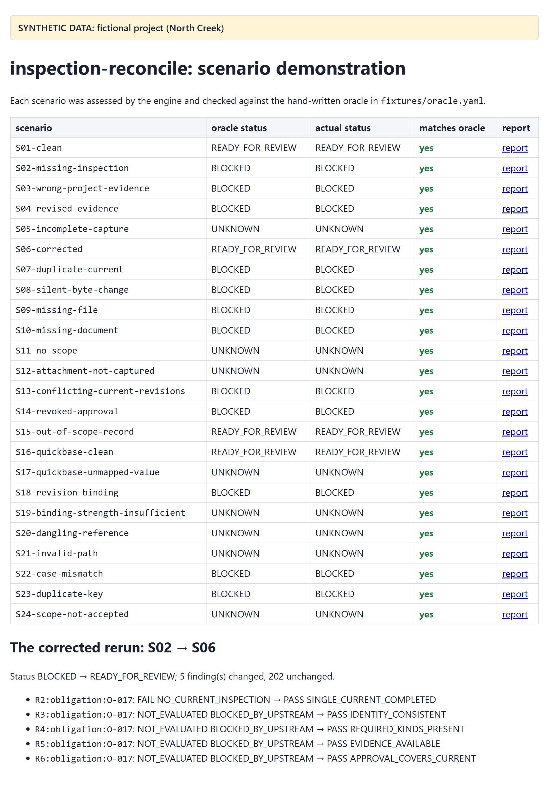

Start with S02, the classic case: one inspection was never recorded.

## Key ideas

### Obligations, records and evidence

- An **obligation** is one piece of required work: an activity (for example `visual_inspection`) on an asset, in a
  project. The accepted scope lists them; North Creek has 40, `O-001` to `O-040`.
- An **inspection** record says the work was done. It links to its obligation, has a revision, and is either the
  *current* revision or a superseded one.
- An **artifact** is a document or photo attached to an inspection. Its file lives in the snapshot's evidence folder
  and is identified by its content digest (SHA-256).
- An **approval** is a reviewer's decision (`approved`, `rejected` or `revoked`) on an inspection revision. It records
  which evidence it covers, either as one *evidence digest* or as the list of artifact revisions it saw.

### Outcomes: PASS, FAIL, UNKNOWN, NOT_EVALUATED

Every check produces a **finding** with one of four outcomes:

| outcome | meaning |
|---|---|
| <span class="pass">PASS</span> | the requirement holds, whatever records might still be missing from the capture |
| <span class="fail">FAIL</span> | the requirement fails, whatever records might still be missing: an established defect |
| <span class="unk">UNKNOWN</span> | the captured data cannot decide; the finding says what would resolve it |
| NOT_EVALUATED | not run, because a prerequisite did not pass; `blocked_by` names the prerequisite |

### Why UNKNOWN is not PASS

Suppose a capture stopped halfway, and obligation O-037 has no inspection in it. The inspection may simply be among
the records that were not captured. Calling that FAIL would be an accusation the data cannot support; calling it PASS
would hide a real gap. The honest answer is UNKNOWN, with the reason `ABSENCE_UNCONFIRMED` and the coverage problem
that caused it.

The same logic works the other way. One captured, complete inspection proves the work was recorded, but under a
partial capture a second, conflicting current inspection could still exist. So "exactly one" stays UNKNOWN
(`CARDINALITY_UNCONFIRMED`) until the capture is known to be complete.

### Project status

The project status is computed from the **required** findings only:

| status | when |
|---|---|
| <span class="fail">BLOCKED</span> | any required finding is FAIL |
| <span class="unk">UNKNOWN</span> | no FAIL, but some required finding is UNKNOWN or NOT_EVALUATED |
| <span class="pass">READY_FOR_REVIEW</span> | every required finding is PASS |

One check, R7 (records outside the scope), is **advisory**: it is reported but never changes the status.

### Roots, dependencies and blocked_by

The checks build on each other. If an obligation has no inspection (R2 fails), there is nothing to check the identity,
the documents or the approval of, so R3 to R6 are NOT_EVALUATED, and each names its prerequisite in `blocked_by`.

A **root** is a required FAIL or UNKNOWN that no other finding caused. Roots are what you fix; everything else follows.
The report lists roots first, and shows for each one how many findings it blocks.

> [!TIP]
> Work through the roots, re-capture, and re-run. A dependent finding usually resolves by itself once its root is
> fixed. The tool shows one problem at a time per obligation: a second, independent problem appears only after the
> first is fixed.

### Coverage: how complete is the capture?

Every captured dataset (inspections, artifacts, approvals, evidence files) carries a **coverage claim**:
`complete_for_declared_scope`, `partial` or `unverified`, together with the **basis** for the claim, for example
`query_total_matched`, `two_pass_stable` and `operator_attestation` for a verified Quickbase read. The requirement pack
lists which bases it accepts. A dataset counts as complete only when its claim is complete *and* its basis is accepted
*and* nothing in the data contradicts it.

Incomplete coverage turns absences into UNKNOWN rather than FAIL. That is exactly fact 2 above.

### Requirement packs

A requirement pack is a small, versioned YAML file. It says which document kinds each activity needs (North Creek's
visual inspections need an `inspection_report` and a `photo`), which coverage bases are acceptable, and how approvals
must bind to evidence: `digest` (the content of the files) or `revisions` (their revision labels). The demonstration
ships two packs, `policies/north-creek-demo.yml` (digest binding) and `policies/north-creek-revisions.yml`.

## Running an assessment

### From a canonical snapshot

```bash
uv run inspection-reconcile assess \
    --snapshot fixtures/scenarios/S02-missing-inspection/snapshot \
    --policy policies/north-creek-demo.yml \
    --out out/s02
```

The command prints one summary line and exits with a code that states the result:

```text
BLOCKED  roots: FAIL=1 UNKNOWN=0  not_evaluated=4  evaluation_id=sha256:bf6a33fe8f6f…
```

| part | meaning |
|---|---|
| `BLOCKED` | the project status |
| `roots: FAIL=1 UNKNOWN=0` | one root failure, no root unknowns |
| `not_evaluated=4` | four required findings were not evaluated, because a prerequisite did not pass |
| `evaluation_id=sha256:bf6a…` | the identity of this evaluation: same inputs, same pack, same time, same id |

### From a Quickbase-shaped export

An export captured from Quickbase is read through a **field mapping** that says which Quickbase field holds which
value. The tool normalizes it into a temporary snapshot, assesses it, and removes the temporary folder:

```bash
uv run inspection-reconcile assess \
    --export fixtures/scenarios/S16-quickbase-clean/export \
    --mapping mappings/quickbase-demo.yml \
    --policy policies/north-creek-demo.yml \
    --out out/s16
```

```text
READY_FOR_REVIEW  roots: FAIL=0 UNKNOWN=0  not_evaluated=0  evaluation_id=sha256:4b0013671cdc…
```

S16 holds the same data as the canonical scenario S01, so it receives the same `evaluation_id`.

### The summary line and the exit code

Scripts and schedulers can act on the exit code alone:

| exit code | meaning |
|---|---|
| 0 | `READY_FOR_REVIEW` (`assess`), no difference (`compare`), every scenario matched (`demo`), or success |
| 10 | `BLOCKED` |
| 11 | `UNKNOWN` |
| 2 | run error: a usage, configuration or input problem; nothing is written |
| 20 | `compare` found semantic differences |
| 30 | `demo`: at least one scenario did not match its oracle |

`assess` always writes its outputs before it exits with 10 or 11. Exit code 1 is never used on purpose.

### What gets written

`--out` names a folder. After a successful run it contains:

| file | for | contents |
|---|---|---|
| `report.html` | people | the report described in the next chapter; one self-contained file that opens offline |
| `assessment.json` | systems | the status, the coverage table, the counts and every finding, in a fixed order |
| `run-manifest.json` | audit | the input files that were read, with their sizes and SHA-256 digests, the tool version and the time of the run |

`assessment.json` and `report.html` are byte-identical for the same inputs, on every operating system. Only
`run-manifest.json` records when and where the run happened.

### Output folders and --force

The `--out` folder must be absent or empty. To re-run into the same folder, add `--force`: the tool then replaces its
own output files and leaves anything else there untouched.

```bash
uv run inspection-reconcile assess --snapshot fixtures/scenarios/S02-missing-inspection/snapshot \
    --policy policies/north-creek-demo.yml --out out/s02 --force
```

> [!NOTE]
> `--force` never deletes anything outside `--out`, and never deletes a file it did not write itself.

### Checking inputs before a run: validate

`validate` loads every file, checks the configuration, and lists the record-level defects that `assess` would report
under R0, without writing anything:

```bash
uv run inspection-reconcile validate \
    --snapshot fixtures/scenarios/S23-duplicate-key/snapshot \
    --policy policies/north-creek-demo.yml
```

```text
R0:inspection:INS-004@1#DUPLICATE_KEY  FAIL  DUPLICATE_KEY  required
assessable: 1 record-level defect(s) would be reported under R0
```

It exits 0 when the inputs can be assessed and 2 when a configuration problem must be fixed first.

## Reading the report

`report.html` is a single file with no scripts and no external resources: it opens offline, prints cleanly, and can be
attached to an email or a ticket as it is. Status colors always come with text labels. The sections appear in the
order below.

### The header

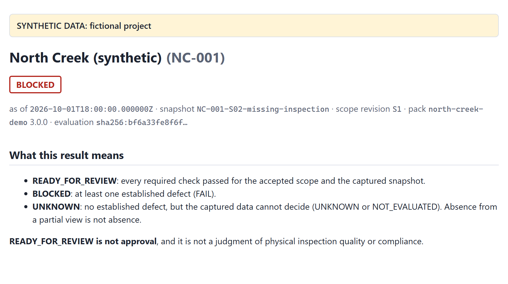

A yellow banner marks synthetic data. Below the project name come the **status**, then one line of context:

- **as of**: the evaluation time. By default it is the end of the capture; `--as-of` sets another.
- **snapshot**: the identifier of the captured snapshot.
- **scope revision**: the accepted scope that defines the expected work.
- **pack**: the requirement pack and its version.
- **evaluation**: the shortened `evaluation_id`. Hover over it for the full value.

### What this result means

This section restates the three statuses in plain language, and that READY_FOR_REVIEW is not approval. It is the
same on every report, so a reader who receives only the report has the definitions at hand.

### Coverage

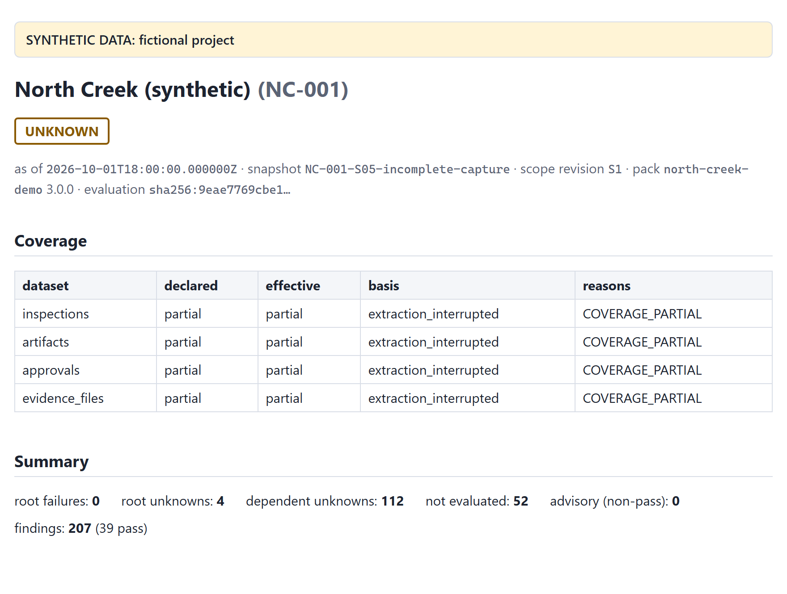

One row per dataset:

| column | meaning |
|---|---|
| declared | what the snapshot manifest claims: `complete_for_declared_scope`, `partial` or `unverified` |
| effective | what the tool accepts after checking the basis and the data; this is the value the checks use |
| basis | the evidence behind the claim, for example `synthetic_universe` or `query_total_matched` |
| reasons | why the effective value is weaker than claimed, if it is |

When `effective` is not `complete_for_declared_scope`, absences in that dataset become UNKNOWN instead of FAIL.

### Summary counts

| count | meaning |
|---|---|
| root failures | required FAILs that nothing else caused: established defects to fix |
| root unknowns | required UNKNOWNs that nothing else caused: usually a coverage gap or an unreadable value |
| dependent unknowns | UNKNOWNs that follow from a coverage root; they resolve when the root does |
| not evaluated | required checks skipped because a prerequisite did not pass |
| advisory (non-pass) | findings that never change the status, such as R7 |
| findings | the total, with the number that passed |

### Root findings

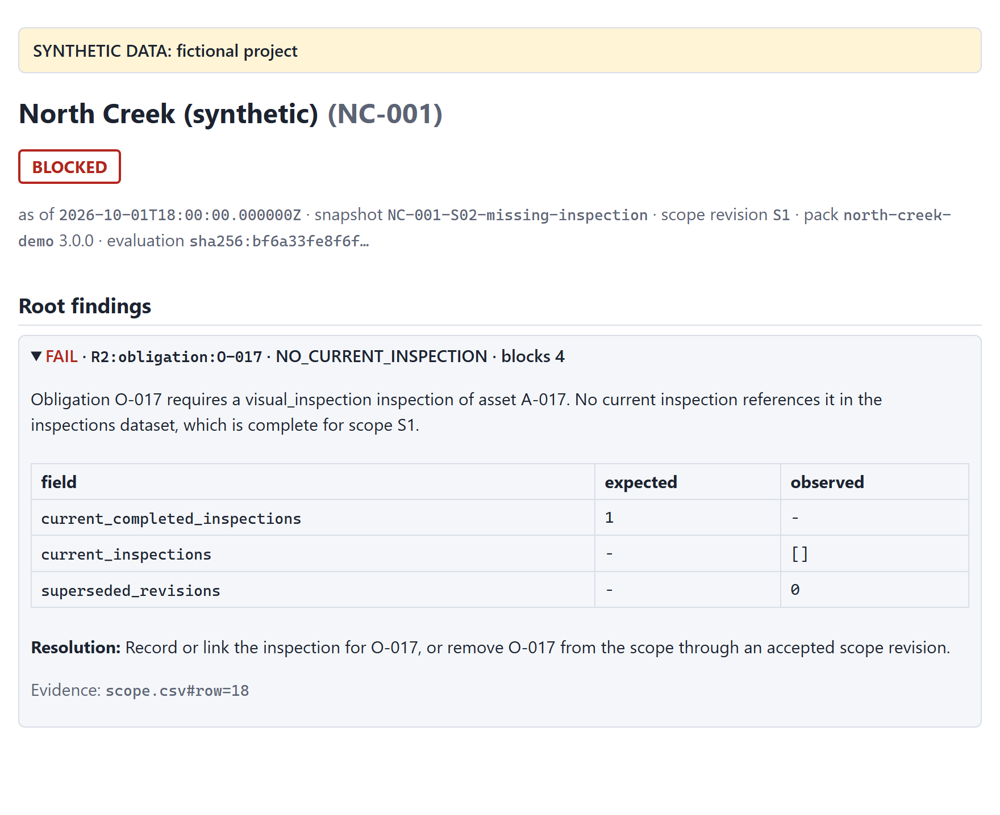

Each root is a collapsible panel, FAIL first, then UNKNOWN. The first three are open. Each one shows:

- the **explanation**, built from the actual values;
- an **expected versus observed** table, with the canonical values the check compared;
- the **resolution**: what would fix the finding, or what information would resolve it;
- the **evidence**: locators of the source rows, such as `scope.csv#row=18`, or `table=bsyn00002;rid=117` for a
  Quickbase record;
- **blocks N**: how many findings depend on this one, directly or through others.

### The obligation grid

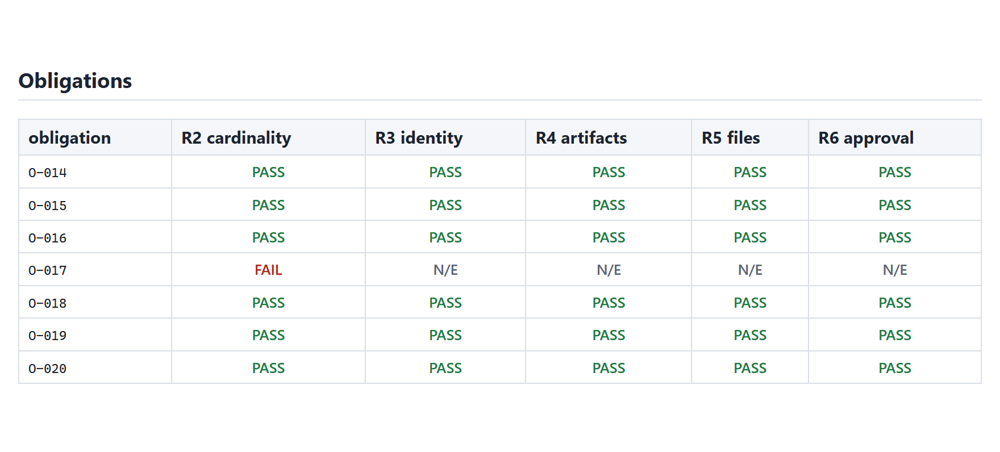

One row per obligation, one column per check from R2 to R6. Cells read `PASS`, `FAIL`, `UNK` or `N/E` (not
evaluated). Hover over a cell to see the reason code. The grid is the quickest way to see whether a problem is
isolated or widespread.

### All findings

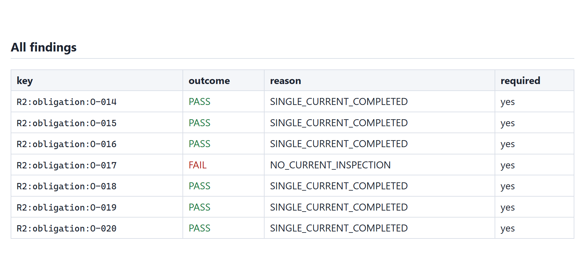

Every finding, in a fixed order: by check (R0 to R7), then by subject. Each row shows the finding's **key**, its
outcome, its reason and whether it is required. A key such as `R2:obligation:O-017` reads "check R2, for the
obligation O-017". It is stable between runs, which is how `compare` matches findings.

### Provenance

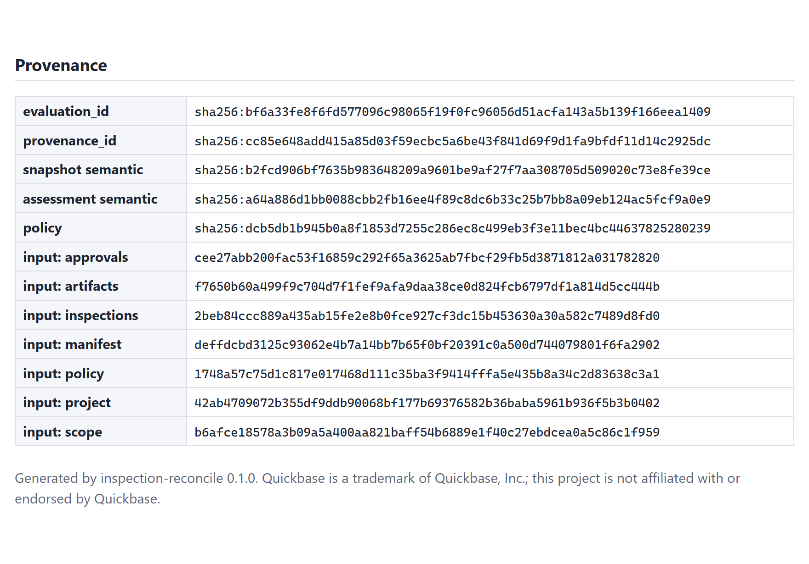

The digests that identify exactly what was assessed:

| value | identifies |
|---|---|
| `evaluation_id` | the meaning of the run: the engine version, the pack, the snapshot's content and the evaluation time. Equal inputs always give an equal id, even if the rows are shuffled or come from an export |
| `provenance_id` | the exact input bytes that were read, as listed in `run-manifest.json` |
| snapshot semantic | the snapshot's content alone |
| assessment semantic | the findings alone; two runs with the same value have the same findings |
| policy | the requirement pack's content |
| input: … | each input file's SHA-256 digest |

### The assessment file

`assessment.json` holds everything the report shows, for other systems to consume. Each finding has the same fields
in the same order: `key`, `check_id`, `check_type`, `required`, `subject`, `outcome`, `reason`, `expected`,
`observed`, `explanation`, `resolution`, `blocked_by`, `caused_by` and `evidence`.

## The eight checks

Each check is described below with the findings it can produce and what to do about each. The resolution text is the
same one the report prints.

### R0 · Input integrity

*Are the captured records themselves sound?* R0 looks for duplicate keys, conflicting current revisions, invalid
values, unsafe file paths and references to records that do not exist. A defective row is **quarantined**: it is
reported and kept out of the other checks, never guessed at.

| code | outcome | meaning | what to do |
|---|---|---|---|
| `INTEGRITY_OK` | PASS | no record-level defect anywhere | nothing |
| `DUPLICATE_KEY` | FAIL | the same key appears more than once | remove or correct the duplicate records in the source |
| `MULTIPLE_CURRENT_REVISIONS` | FAIL | two revisions of one inspection or artifact are both marked current | mark exactly one revision current |
| `COMPLETED_WITHOUT_TIMESTAMP` | FAIL | a current, completed inspection has no completion time | record the completion time |
| `INVALID_VALUE` | UNKNOWN | a value does not match its type, for example an ID with a trailing space | correct the value in the source, or the mapping |
| `UNMAPPED_VALUE` | UNKNOWN | a Quickbase choice the field mapping does not know | confirm the value's meaning and extend the mapping's value map |
| `INVALID_PATH` | UNKNOWN | a file path that is unsafe or malformed; the file is never opened | correct the inventory path |
| `MALFORMED_ROW` | UNKNOWN | a CSV row with the wrong number of fields | repair the row in the source export |
| `TIMESTAMP_AFTER_AS_OF` | UNKNOWN | a completion or decision time later than the evaluation time | check the time zone, the source value or the capture time |
| `DANGLING_REFERENCE` | UNKNOWN | a record refers to one that is absent from a dataset declared complete | capture the referenced record, or correct the reference |

An R0 finding is **required** when it concerns a record of an in-scope obligation, or a record that cannot be
attributed to any obligation. A finding about a record outside the scope is advisory.

### R1 · Scope and coverage

*Is there an accepted scope, and how complete is each dataset?* R1 produces one finding for the project and one per
dataset.

| code | outcome | meaning | what to do |
|---|---|---|---|
| `SCOPE_ESTABLISHED` | PASS | an accepted scope lists the obligations | nothing |
| `SCOPE_MISSING` | UNKNOWN | no scope was supplied; nothing can be assessed | supply the accepted scope |
| `SCOPE_NOT_ACCEPTED` | UNKNOWN | the scope has no acceptance record | record who accepted the scope, and when |
| `SCOPE_INVALID`, `SCOPE_EMPTY`, `SCOPE_REVISION_MISMATCH`, `SCOPE_PROJECT_MISMATCH` | UNKNOWN | the scope rows cannot be identified, are empty, or disagree with the pack or the project | correct the scope, or align its revision with the pack |
| `COVERAGE_COMPLETE` | PASS | the dataset is complete for the declared scope, on an accepted basis | nothing |
| `DATASET_MISSING` | UNKNOWN | the dataset was not supplied | capture it |
| `COVERAGE_PARTIAL`, `COVERAGE_UNVERIFIED` | UNKNOWN | the capture is declared partial or unverified | capture the dataset completely, with a basis the pack accepts |
| `COVERAGE_BASIS_NOT_ACCEPTED` | UNKNOWN | declared complete, on a basis the pack does not accept | re-capture with an accepted basis, or amend the pack deliberately |
| `CHANGED_DURING_CAPTURE` | UNKNOWN | records changed while the capture ran | re-capture when the source is stable |
| `COVERAGE_CONTRADICTED`, `UNATTRIBUTABLE_RECORDS` | UNKNOWN | the data contradicts the completeness claim | capture the missing records, or correct the rows |

When the project finding is not PASS, every per-obligation check is NOT_EVALUATED: without a scope there is no
expected work to compare against.

### R2 · Inspection cardinality

*Does each obligation have exactly one current, completed inspection?*

| code | outcome | meaning | what to do |
|---|---|---|---|
| `SINGLE_CURRENT_COMPLETED` | PASS | exactly one current inspection, and it is completed | nothing |
| `NO_CURRENT_INSPECTION` | FAIL | no current inspection references the obligation, and the inspections are complete | record or link the inspection, or remove the obligation through an accepted scope revision |
| `MULTIPLE_CURRENT` | FAIL | two or more current inspections reference it | mark superseded inspections not current, or correct their links |
| `NOT_COMPLETED` | FAIL | the current inspection is not completed | complete the inspection, or correct its status |
| `ABSENCE_UNCONFIRMED` | UNKNOWN | none captured, but the inspections are not complete | capture the complete inspections dataset |
| `CARDINALITY_UNCONFIRMED` | UNKNOWN | one captured, but another could exist uncaptured | capture the complete inspections dataset |

### R3 · Identity consistency

*Do the inspection and its documents name the obligation's project, asset and activity?* A report filed against the
wrong asset is caught here.

| code | outcome | meaning | what to do |
|---|---|---|---|
| `IDENTITY_CONSISTENT` | PASS | the inspection and its current documents all match | nothing |
| `INSPECTION_PROJECT_MISMATCH`, `INSPECTION_ASSET_MISMATCH`, `INSPECTION_ACTIVITY_MISMATCH` | FAIL | the inspection names another project, asset or activity | correct the inspection, or link it to the correct obligation |
| `ARTIFACT_PROJECT_MISMATCH`, `ARTIFACT_ASSET_MISMATCH` | FAIL | an attached document names another project or asset | attach the correct document, or correct the artifact |
| `IDENTITY_UNCONFIRMED` | UNKNOWN | no conflict found, but the artifacts are not complete | capture the complete artifacts dataset |

### R4 · Required artifacts

*Is there a current document of every kind the pack requires?*

| code | outcome | meaning | what to do |
|---|---|---|---|
| `REQUIRED_KINDS_PRESENT` | PASS | every required kind is present | nothing |
| `KIND_MISSING` | FAIL | a required kind is missing, and the artifacts are complete | attach the missing document, or correct its kind or current flag |
| `KIND_ABSENCE_UNCONFIRMED` | UNKNOWN | a required kind was not captured, but the artifacts are not complete | capture the complete artifacts dataset |
| `REQUIREMENT_UNDEFINED` | UNKNOWN | the pack defines no documents for this activity | add requirements for the activity to the pack |

### R5 · Artifact availability

*Can every required file be read and hashed?* File names are matched exactly, including letter case, on every
operating system, so a result never depends on where the tool runs.

| code | outcome | meaning | what to do |
|---|---|---|---|
| `EVIDENCE_AVAILABLE` | PASS | every required file was read and hashed | nothing |
| `FILE_ABSENT` | FAIL | a required file is not in the evidence, which is complete | restore the file, or correct the inventory path |
| `NOT_CAPTURED` | UNKNOWN | a required file was not captured; the evidence is partial | capture the file, or confirm its absence in the source |
| `FILE_UNREADABLE` | UNKNOWN | the file exists but could not be read | fix the file's permissions or format, then re-run |
| `FILE_TOO_LARGE` | UNKNOWN | the file exceeds the pack's size limit | raise the limit deliberately, or review the file separately |
| `AVAILABILITY_UNCONFIRMED` | UNKNOWN | every captured file was available, but other required artifacts could exist | capture the complete artifacts dataset |

When a file is absent only because of letter case (`Photo.png` against `photo.png`), the explanation says so:
"A file differing only in letter case exists".

### R6 · Approval binding

*Does the latest approval cover the current inspection revision and the current evidence?*

| code | outcome | meaning | what to do |
|---|---|---|---|
| `APPROVAL_COVERS_CURRENT` | PASS | the latest decision approves the current revision and evidence | nothing |
| `NO_APPROVAL` | FAIL | there is no decision at all, and the approvals are complete | obtain a review decision |
| `REVISION_NOT_APPROVED` | FAIL | approvals exist, but only for older revisions | obtain approval for the current revision |
| `EVIDENCE_CHANGED_SINCE_APPROVAL` | FAIL | the decisions bind different evidence: it changed after approval | re-review the current evidence, or restore the approved version |
| `APPROVAL_REJECTED`, `APPROVAL_REVOKED` | FAIL | the latest decision on the current evidence is a rejection or a revocation | resolve the reviewer's decision |
| `APPROVAL_UNCONFIRMED` | UNKNOWN | the approvals are not complete; a later decision could exist | capture the complete approvals dataset |
| `BINDING_UNAVAILABLE` | UNKNOWN | the approval does not record which evidence it covers | record the evidence digest, or the approved artifact revisions |
| `BINDING_STRENGTH_INSUFFICIENT` | UNKNOWN | the approval binds revisions only, but the pack requires a digest | record the evidence digest, or use a pack that accepts revision binding |
| `CONFLICTING_DECISIONS` | UNKNOWN | decisions with the same timestamp disagree | correct the decision records |

**Digest binding and revision binding.** With **digest** binding, the default, an approval stores one *evidence
digest*: a SHA-256 over the content of every required file. Change one byte of one photo and the digest no longer
matches. With **revision** binding, an approval lists the artifact revisions it saw. That is weaker: a file replaced
under an unchanged revision label goes unnoticed. Scenarios S08 and S18 show the difference.

**The digest an approval should store.** `evidence-digest` prints it, together with the files it covers:

```bash
uv run inspection-reconcile evidence-digest \
    --snapshot fixtures/scenarios/S01-clean/snapshot \
    --policy policies/north-creek-demo.yml --inspection INS-001
```

```text
sha256:4d97b90411ac5ee1c2e0f1564a147d0b3d84c3fe16d4c9bed7ccbb8c983e63d6
[
  {
    "artifact_id": "ART-001-P",
    "document_kind": "photo",
    "revision": "1",
    "sha256": "14e2f9ba2bf3bfecf24618d6be0387d667f7a3ed932ddaceefb0f5a1f6d90c99"
  },
  ...
]
```

A review process that stores this value with its decision gets byte-level protection: any later change to the
evidence is detected as `EVIDENCE_CHANGED_SINCE_APPROVAL`.

### R7 · Unmatched records (advisory)

*Are there current inspections outside the accepted scope?* An inspection that points at no in-scope obligation often
means the scope is stale. R7 reports it as `UNMATCHED_INSPECTION`, which is advisory: it never changes the status.
`NO_UNMATCHED_RECORDS` means every captured current inspection references an in-scope obligation.

## Comparing runs

### Running compare

`compare` matches the findings of two assessments by key and reports what changed. Each argument is an
`assessment.json` or a folder that contains one:

```bash
uv run inspection-reconcile compare --before out/s02 --after out/s06
```

```text
BLOCKED -> READY_FOR_REVIEW  changed=5 added=0 removed=0 unchanged=202
```

It exits 0 when nothing changed and 20 when something did, so a script can tell a fixed package from an unchanged
one. A finding counts as **changed** when its outcome, reason, expected or observed values, `blocked_by`, `caused_by`
or requiredness differ. Explanation texts and evidence locators are not compared.

### Reading comparison.json

`--out FILE` writes the comparison as JSON:

```bash
uv run inspection-reconcile compare --before out/s02 --after out/s06 --out out/compare.json
```

```json
{
  "schema": "inspection-reconcile/comparison/v1",
  "before": {"evaluation_id": "sha256:bf6a…", "status": "BLOCKED"},
  "after": {"evaluation_id": "sha256:eda9…", "status": "READY_FOR_REVIEW"},
  "added": [],
  "removed": [],
  "changed": [
    {"key": "R2:obligation:O-017",
     "before": {"outcome": "FAIL", "reason": "NO_CURRENT_INSPECTION"},
     "after": {"outcome": "PASS", "reason": "SINGLE_CURRENT_COMPLETED"}},
    ...
  ],
  "unchanged_count": 202
}
```

- `added` and `removed` list keys present in only one of the two assessments.
- `changed` lists each changed finding's outcome and reason, before and after.
- `unchanged_count` counts the rest.

An existing `--out` file is replaced only with `--force`, and `compare` refuses to write over either of its inputs.

## A guided tour

Five scenarios show the tool's behavior from start to finish. Each command below was run as printed.

### S02 → S06: a missing inspection, found and fixed

In S02, obligation O-017 (a visual inspection of asset A-017) has no inspection record at all. The inspections
dataset is complete, so the absence is an established defect.

```bash
uv run inspection-reconcile assess --snapshot fixtures/scenarios/S02-missing-inspection/snapshot \
    --policy policies/north-creek-demo.yml --out out/s02                       # exit 10: BLOCKED
```

The report has a single root failure, `R2:obligation:O-017 · NO_CURRENT_INSPECTION · blocks 4`. Its R3 to R6 are
NOT_EVALUATED, because there is no inspection to check. S06 is the same project after the inspection was recorded:

```bash
uv run inspection-reconcile assess --snapshot fixtures/scenarios/S06-corrected/snapshot \
    --policy policies/north-creek-demo.yml --out out/s06                       # exit 0: READY_FOR_REVIEW
uv run inspection-reconcile compare --before out/s02 --after out/s06           # exit 20
```

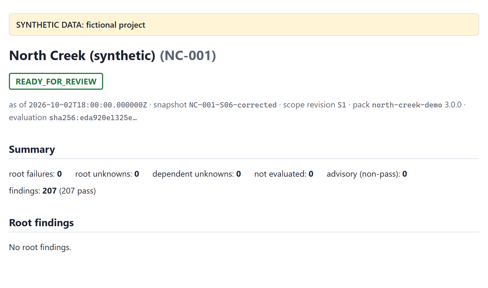

`compare` shows exactly five changed findings, R2 to R6 for O-017, and 202 unchanged. Fixing the root resolved
everything that depended on it.

### S05: an incomplete capture

S05's capture was interrupted: every dataset is declared `partial` on the basis `extraction_interrupted`.

```bash
uv run inspection-reconcile assess --snapshot fixtures/scenarios/S05-incomplete-capture/snapshot \
    --policy policies/north-creek-demo.yml --out out/s05                       # exit 11: UNKNOWN
```

```text
UNKNOWN  roots: FAIL=0 UNKNOWN=4  not_evaluated=52  evaluation_id=sha256:9eae7769cbe1…
```

The four roots are the coverage findings, one per dataset. Obligations whose inspections were not captured get
`ABSENCE_UNCONFIRMED`, not FAIL: they may well be among the records the capture missed. The other 112 unknowns are
dependent; they resolve once a complete capture replaces this one.

### S08: an approval that no longer covers the evidence

In S08, the photo for O-009 was replaced after approval, under the same revision label. The approval's evidence digest
no longer matches the current bytes.

```bash
uv run inspection-reconcile assess --snapshot fixtures/scenarios/S08-silent-byte-change/snapshot \
    --policy policies/north-creek-demo.yml --out out/s08                       # exit 10: BLOCKED
```

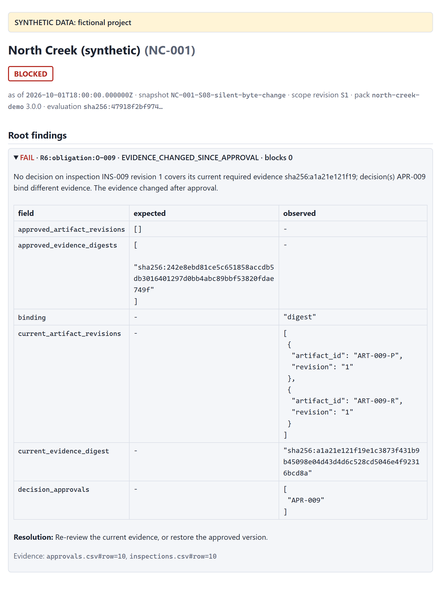

The root is `R6:obligation:O-009 · EVIDENCE_CHANGED_SINCE_APPROVAL`. The expected-versus-observed table shows the
digest the approval stored next to the digest of the current files. Under revision binding (scenario S18) the same
change cannot be seen, which is why digest binding is the default.

### S12: attachments that were not captured

In S12, the capture skipped one attachment on purpose, and the manifest says so: the evidence files are `partial`,
on the basis `attachment_capture_skipped`.

```bash
uv run inspection-reconcile assess --snapshot fixtures/scenarios/S12-attachment-not-captured/snapshot \
    --policy policies/north-creek-demo.yml --out out/s12                       # exit 11: UNKNOWN
```

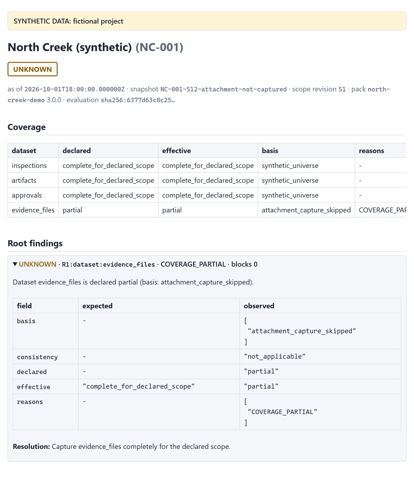

The root is the coverage finding for `evidence_files`. The missing file gives R5 `NOT_CAPTURED` for O-019, an UNKNOWN
caused by that root, rather than `FILE_ABSENT`, a FAIL. The tool does not accuse a file it was never shown.

### S17: a Quickbase value the mapping does not know

S17 is a Quickbase-shaped export in which one inspection's status reads `Completed - pending QA`. That choice is not in
the mapping's value map. The tool does not guess what it means:

```bash
uv run inspection-reconcile assess --export fixtures/scenarios/S17-quickbase-unmapped-value/export \
    --mapping mappings/quickbase-demo.yml --policy policies/north-creek-demo.yml --out out/s17   # exit 11
```

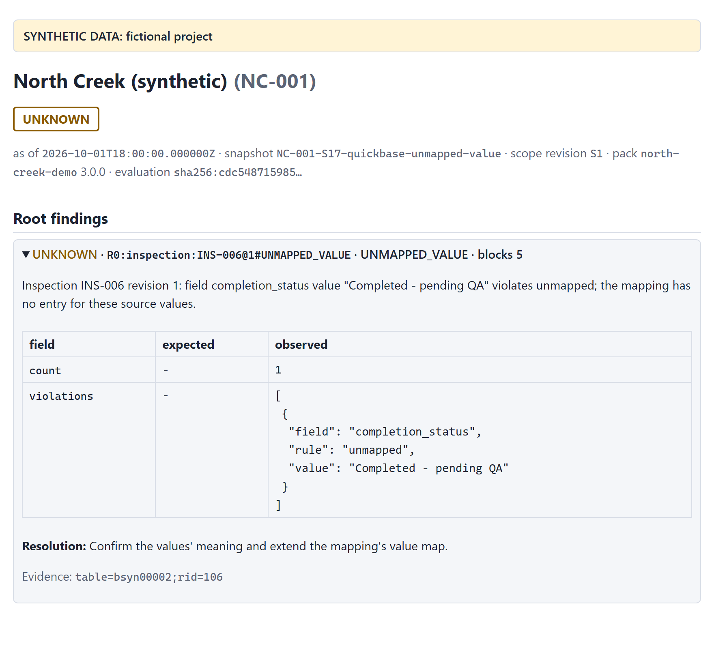

The root is `R0:inspection:INS-006@1#UNMAPPED_VALUE`. The fix belongs to whoever owns the mapping: confirm what the
new choice means, then extend the value map. Until then, O-006's checks are NOT_EVALUATED.

## Troubleshooting

### The command stopped with exit code 2

Exit code 2 is a run error: the tool wrote nothing and printed one diagnostic line, `error: CODE: message`. The most
common ones:

| code | cause | what to do |
|---|---|---|
| `OUT_NOT_EMPTY` | the `--out` folder already holds files | use a new folder, or add `--force` to replace the tool's own outputs |
| `OUT_EXISTS` | `compare --out` or `export-sqlite --out` names an existing file | choose another file name, or add `--force` |
| `USAGE` | a missing or conflicting option, for example `--export` without `--mapping` | correct the command; `--help` lists the options |
| `POLICY_NOT_EFFECTIVE` | the evaluation time is before the pack's `effective_from` date | use the pack that was in force, or a later `--as-of` |
| `PROJECT_MISMATCH` | the snapshot's project is not the pack's project | use the pack for this project |
| `CONFIG_INVALID`, `CONFIG_UNREADABLE` | a pack, mapping or manifest has an unknown member or a wrong value, or cannot be read | read the message: it names the file and the member |
| `CSV_HEADER_INVALID`, `CSV_UNREADABLE` | a CSV file has the wrong columns, or is not UTF-8 | fix the export, then capture again |
| `COMPARE_INPUT_INVALID` | a `compare` argument is not an assessment | point it at an `assessment.json` or at an output folder |

The [Administrator Guide](admin-guide.md#run-error-codes) lists every code.

### Common questions

**Nothing failed, so why is the status UNKNOWN?** Some required finding could not be decided, usually because a
dataset is not complete. Look at the coverage table and the root unknowns: each one says what information would
resolve it.

**Why are so many checks NOT_EVALUATED?** They depend on a root that did not pass. Fix the root and re-run; most of
them resolve by themselves.

**The file is there, but the report says FILE_ABSENT.** Compare the letter case of the inventory path with the actual
file name. The tool matches names exactly on every operating system, and the explanation adds a hint when only the
case differs.

**The approval exists, but R6 fails.** Look at the expected-versus-observed table. Either the approval covers an older
revision (`REVISION_NOT_APPROVED`), or the evidence changed after it was approved
(`EVIDENCE_CHANGED_SINCE_APPROVAL`).

**The report says READY_FOR_REVIEW. Is the project approved?** No. The documentation is complete and consistent for
the captured snapshot, so the review can start. Approval is a person's decision.

**Can I feed the output to another system?** Yes: use `assessment.json` and the exit code. Use `--log-json` to get
diagnostics on standard error as JSON lines.

## Glossary

| term | meaning |
|---|---|
| accepted scope | the list of obligations, with a revision and a record of who accepted it, and when |
| advisory | a finding that is reported but never changes the status (R7, and R0 findings outside the scope) |
| artifact | a document or photo attached to an inspection, identified by its content digest |
| basis | the evidence behind a coverage claim, such as `query_total_matched` |
| blocked_by | the prerequisite findings that kept a check from running |
| caused_by | the coverage finding behind an UNKNOWN |
| coverage | how complete a captured dataset is, as declared and as effectively accepted |
| evidence digest | a SHA-256 over the content of an inspection's required files; what an approval should store |
| evaluation_id | the identity of an evaluation: the engine, the pack, the snapshot's content and the evaluation time |
| finding | the result of one check for one subject: an outcome, a reason, values, an explanation and a resolution |
| obligation | one piece of required work: an activity on an asset in a project |
| oracle | the hand-written expected result of each fixture scenario |
| requirement pack | the versioned YAML file that says what each activity requires |
| root | a required FAIL or UNKNOWN that no other finding caused |
| snapshot | a captured set of scope, records and evidence files, described by a manifest |
